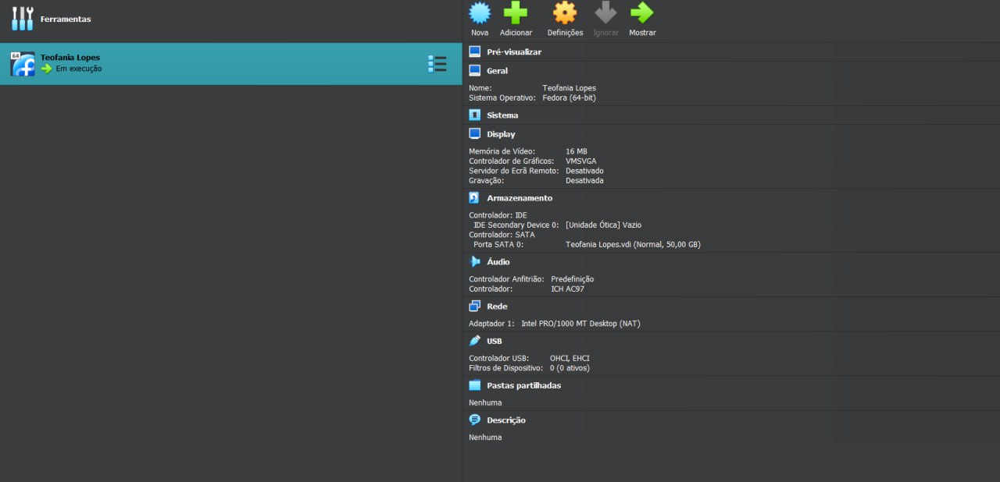

---
## Front matter
lang: ru-RU
title: Презентация по лабораторной работе №1
subtitle: Архитектура компьютеров и операционные системы
author:
  - Гомес Лопес Теофания.
institute:
  - Российский университет дружбы народов, Москва, Россия
date: 02 марта 2024

## i18n babel
babel-lang: russian
babel-otherlangs: english

## Formatting pdf
toc: false
toc-title: Содержание
slide_level: 2
aspectratio: 169
section-titles: true
theme: metropolis
header-includes:
 - \metroset{progressbar=frametitle,sectionpage=progressbar,numbering=fraction}
 - '\makeatletter'
 - '\beamer@ignorenonframefalse'
 - '\makeatother'
---

# Цель работы

Целью данной работы является приобретение практических навыков установки операционной системы на виртуальную машину, настройки минимально необходимых для дальнейшей работы сервисов.

# Задание

- Создание виртуальной машины
- Установка операционной системы
- Установка драйверов для VirtualBox
- Настройка раскладки клавиатуры
- Установка имени пользователя и названия хоста
- Установка программного обеспечения для создания документации

# Создание виртуальной машины

Я уже установила и настроила виртуальную машину 

{#fig:001 width=70%}

## Установка драйверов для VirtualBox

- Установливаю программы для удобства работы в консоли:

{#fig:002 width=70%}

Устанавливаю программы для облегчения работы в консоли: 

{#fig:003 width=70%}

Я устанавливаю программное обеспечение для автоматического обновления

{#fig:004 width=70%}

Я запускаю таймер: 

{#fig:005 width=70%}

- Я не буду рассматривать работу с системой безопасности SELinux, поэтому отключим его:: 

{#fig:006 width=70%}

Запускаю терминальный мультиплексор tmux, переключаюсь на роль супер-пользователя используя sudo -i и установляю средства разработки:

{#fig:007 width=70%}

Установливаю пакет DKMS используя dnf -y install dkms. В меню виртуальной машины подключаю образ диска дополнений гостевой ОС.

{#fig:008 width=70%}

Далее установливаю драйвера указав /media/VBoxLinuxAdditions.run и перегружаю виртуальную машину.

## Настройка раскладки клавиатуры

 - Запускаю терминальный мультиплексор tmux. Создаю конфигурационный файл.
- Отредактирую конфигурационный файл и переключаюсь на роль супер-пользователя:

{#fig:009 width=70%}

{#fig:010 width=70%}

{#fig:011 width=70%}

## Установка имени пользователя и названия хоста

- Запукаю виртуальную машину и залогинуюсь. Нажимаю комбинацию Win+Enter для запуска терминала. Запускаю терминальный мультиплексор tmux. Переключаюсь на роль супер-пользователя. Создаю пользователя и задаю пароль для пользователя:

{#fig:012 width=70%}

Проверяю, что имя хоста установлено верно: 

{#fig:013 width=70%}

## Установка программного обеспечения для создания документации

Установливаю pandoc с помощью менеджера пакетов:

{#fig:015 width=70%}

Установливаю TexLive с помощью менеджера пакетов: 

{#fig:016 width=70%}

# Выводы

При выполнении проделанной работы я приобретела практические навыки установки операционной системы на виртуальную машину, настройки минимально необходимых для дальнейшей работы сервисов.
