---
## Front matter
title: "Отчёт по лабораторной работе №1"
subtitle: "Дисциплина: Архитектура компьютеров и операционные системы"
author: "Гомес Лопес Теофания"

## Generic otions
lang: ru-RU
toc-title: "Содержание"

## Bibliography
bibliography: bib/cite.bib
csl: pandoc/csl/gost-r-7-0-5-2008-numeric.csl

## Pdf output format
toc: true # Table of contents
toc-depth: 2
lof: true # List of figures
lot: true # List of tables
fontsize: 12pt
linestretch: 1.5
papersize: a4
documentclass: scrreprt
## I18n polyglossia
polyglossia-lang:
  name: russian
  options:
	- spelling=modern
	- babelshorthands=true
polyglossia-otherlangs:
  name: english
## I18n babel
babel-lang: russian
babel-otherlangs: english
## Fonts
mainfont: IBM Plex Serif
romanfont: IBM Plex Serif
sansfont: IBM Plex Sans
monofont: IBM Plex Mono
mathfont: STIX Two Math
mainfontoptions: Ligatures=Common,Ligatures=TeX,Scale=0.94
romanfontoptions: Ligatures=Common,Ligatures=TeX,Scale=0.94
sansfontoptions: Ligatures=Common,Ligatures=TeX,Scale=MatchLowercase,Scale=0.94
monofontoptions: Scale=MatchLowercase,Scale=0.94,FakeStretch=0.9
mathfontoptions:
## Biblatex
biblatex: true
biblio-style: "gost-numeric"
biblatexoptions:
  - parentracker=true
  - backend=biber
  - hyperref=auto
  - language=auto
  - autolang=other*
  - citestyle=gost-numeric
## Pandoc-crossref LaTeX customization
figureTitle: "Рис."
tableTitle: "Таблица"
listingTitle: "Листинг"
lofTitle: "Список иллюстраций"
lotTitle: "Список таблиц"
lolTitle: "Листинги"
## Misc options
indent: true
header-includes:
  - \usepackage{indentfirst}
  - \usepackage{float} # keep figures where there are in the text
  - \floatplacement{figure}{H} # keep figures where there are in the text
---

# Цель работы

Целью данной работы является приобретение практических навыков установки операционной системы на виртуальную машину, настройки минимально необходимых для дальнейшей работы сервисов.

# Задание

1. Создание виртуальной машины
2. Установка операционной системы
3. Установка драйверов для VirtualBox
4. Настройка раскладки клавиатуры
5. Установка имени пользователя и названия хоста
6. Установка программного обеспечения для создания документации

# Выполнение лабораторной работы
# Создание виртуальной машины

Я уже установила и настроила виртуальную машину (рис. [-@fig:001]).

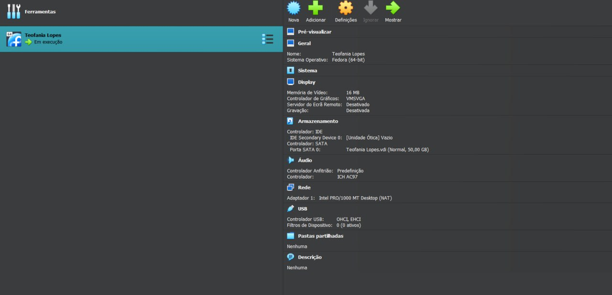{#fig:001 width=70%}

## Установка драйверов для VirtualBox

После завершения установки операционной системы я перезапускаю виртуальную машину. Затем я вхожу в операционную систему, используя учетную запись, указанную при установке. Нажмите комбинацию Win+Enter, чтобы запустить терминал. Переключаюсь на роль суперпользователя и обновляю все пакеты: (рис. [-@fig:002]).

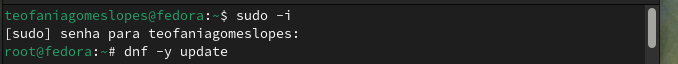{#fig:002 width=70%}

Устанавливаю программы для облегчения работы в консоли: (рис. [-@fig:003]).

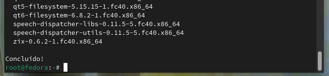{#fig:003 width=70%}

Я устанавливаю программное обеспечение для автоматического обновления: (рис. [-@fig:004]).

{#fig:004 width=70%}

Я запускаю таймер: (рис. [-@fig:005]).

{#fig:005 width=70%}

Я не буду рассматривать работу с системой безопасности SELinux, поэтому отключим его. В файле /etc/selinux/config заменяю значение SELINUX=enforcing на значение SELINUX=permissive. Перегрузаю виртуальную машину: (рис. [-@fig:006]).

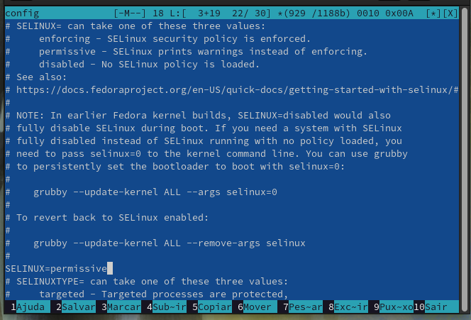{#fig:006 width=70%}

Вхожу в ОС под заданной мной при установке учётной записью. Нажимаю комбинацию Win+Enter для запуска терминала. Запускаю терминальный мультиплексор tmux, переключаюсь на роль супер-пользователя используя sudo -i и установляю средства разработки: (рис. [-@fig:007]).

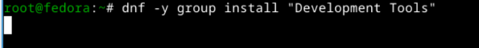{#fig:007 width=70%}

Установливаю пакет DKMS используя dnf -y install dkms. В меню виртуальной машины подключаю образ диска дополнений гостевой ОС. Подмонтирую диск mount /dev/sr0 /media (рис. [-@fig:008]).

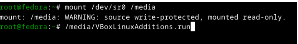{#fig:008 width=70%}

Далее установливаю драйвера указав /media/VBoxLinuxAdditions.run и перегружаю виртуальную машину.

## Настройка раскладки клавиатуры

Вхожу в ОС под заданной мной при установке учётной записью. Нажимаю комбинацию Win+Enter для запуска терминала. Запускаю терминальный мультиплексор tmux. Создаю конфигурационный файл. Переключаюсь на роль супер-пользователя с помощью sudo -i и отредактирую конфигурационный файл /etc/X11/xorg.conf.d/00-keyboard.conf. После этого перегружаю машину: (рис. [-@fig:009]).

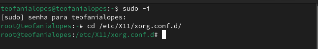{#fig:009 width=70%}

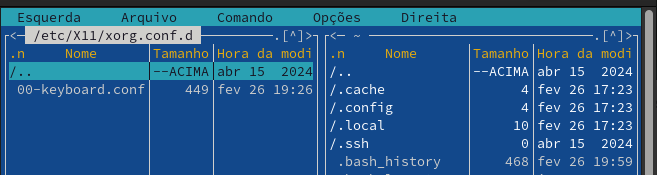{#fig:010 width=70%}

{#fig:011 width=70%}

## Установка имени пользователя и названия хоста

Запукаю виртуальную машину и залогинуюсь. Нажимаю комбинацию Win+Enter для запуска терминала. Запускаю терминальный мультиплексор tmux. Переключаюсь на роль супер-пользователя. Создаю пользователя (вместо username указиваю мой логин в дисплейном классе) и задаю пароль для пользователя: (рис. [-@fig:012]).

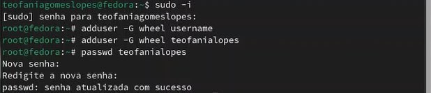{#fig:012 width=70%}

Проверяю, что имя хоста установлено верно: (рис. [-@fig:013]).

{#fig:013 width=70%}

## Установка программного обеспечения для создания документации

Нажимаю комбинацию Win+Enter для запуска терминала. Запускаю терминальный мультиплексор tmux и переключаюсь на роль супер-пользователя:  (рис. [-@fig:014]).

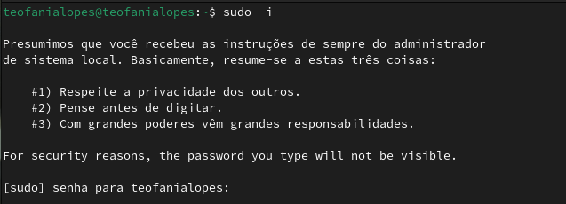{#fig:014 width=70%}

Установливаю pandoc с помощью менеджера пакетов: (рис. [-@fig:015]).

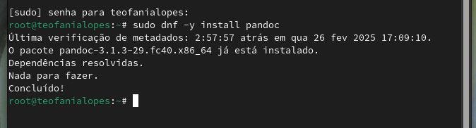{#fig:015 width=70%}

Установливаю TexLive с помощью менеджера пакетов: (рис. [-@fig:016]).

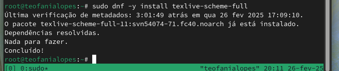{#fig:016 width=70%}

# Выводы

При выполнении проделанной работы я приобретела практические навыки установки операционной системы на виртуальную машину, настройки минимально необходимых для дальнейшей работы сервисов.

# Дополнительное задание

В окне терминала проанализирую последовательность загрузки системы, выполнив команду dmesg:

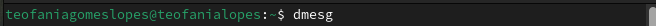{#fig:017 width=70%}

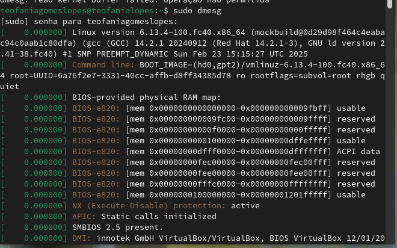{#fig:018 width=70%}

С помощью grep (dmesg | grep -i "то, что ищем"), получаю:
- Версию ядра Linux (Linux version).

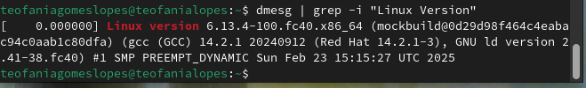{#fig:019 width=70%}

- Частота процессора (Detected Mhz processor):

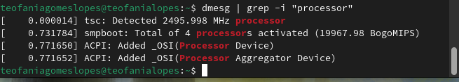{#fig:020 width=70%}

- Модель процессора (CPU0):

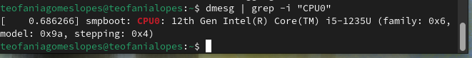{#fig:021 width=70%}

- Объём доступной оперативной памяти (Memory available):

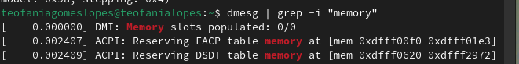{#fig:022 width=70%}

- Тип обнаруженного гипервизора (Hypervisor detected):

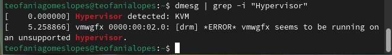{#fig:023 width=70%}

- Последовательность монтирования файловых систем: 

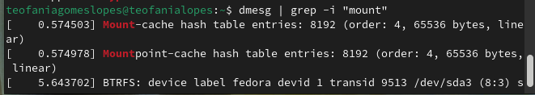{#fig:024 width=70%}

# Контрольные вопросы (ответы)

1. Учетная запись содержит необходимые для идентификации пользователя при подключении к системе данные, а так же информацию для авторизации и учета: системного имени (user name) (оно может содержать только латинские буквы и знак нижнее подчеркивание, еще оно должно быть уникальным), идентификатор пользователя (UID) (уникальный идентификатор пользователя в системе, целое положительное число), идентификатор группы (CID) (группа, к к-рой относится пользователь. Она, как минимум, одна, по умолчанию - одна), полное имя (full name) (Могут быть ФИО), домашний каталог (home directory) (каталог, в к-рый попадает пользователь после входа в систему и в к-ром хранятся его данные), начальная оболочка (login shell) (командная оболочка, к-рая запускается при входе в систему).

2. Для получения справки по команде: --help,
   для перемещения по файловой системе - cd, 
   для просмотра содержимого каталога - ls,
   для определения объёма каталога - du <имя каталога>,
   для создания / удаления каталогов - mkdir/rmdir, 
   для создания / удаления файлов - touch/rm,
   для задания определённых прав на файл / каталог - chmod,
   для просмотра истории команд - history

3. Файловая система - это порядок, определяющий способ организации и хранения и именования данных на различных носителях информации. 
   Примеры: FAT32 представляет собой пространство, разделенное на три части: олна область для служебных структур, форма указателей в виде таблиц и зона для хранения самих файлов. ext3/ext4 - журналируемая файловая система, используемая в основном в ОС с ядром Linux.

4. С помощью df в терминале. Это утилита, которая показывает список всех файловых систем по именам устройств, сообщает их размер и данные о памяти. Также посмотреть подмонтированные файловые системы можно с помощью утилиты mount.

5. Чтобы удалить зависший процесс, вначале мы должны узнать, какой у него id: используем команду ps. Далее в терминале вводим команду kill < id процесса >. Или можно использовать утилиту killall, что "убьет" все процессы, которые есть в данный момент, для этого не нужно знать id процесса.

# Список литературы{.unnumbered}

::: {#refs}
:::
