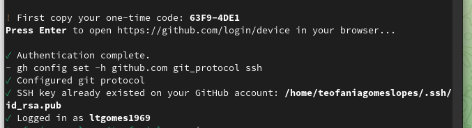
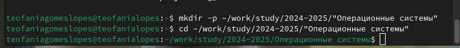

---
## Front matter
lang: ru-RU
title: Отчёт по лабораторной работе 2
subtitle: Операционные Системы
author:
  - .Гомес Лопес Теофания
institute:
  - Российский университет дружбы народов, Москва, Россия
date: 03 марта 2025

## i18n babel
babel-lang: russian
babel-otherlangs: english

## Formatting pdf
toc: false
toc-title: Содержание
slide_level: 2
aspectratio: 169
section-titles: true
theme: metropolis
header-includes:
 - \metroset{progressbar=frametitle,sectionpage=progressbar,numbering=fraction}
---

# Информация

## Докладчик

:::::::::::::: {.columns align=center}
::: {.column width="70%"}
::: {.column width="30%"}

:::
::::::::::::::

# Цель работы

Изучение идеалогии, применение средств контроля версий и освоение умения по работе с git.

# Задание

1.Создать базовую конфигурацию для работы с git.
2.Создать ключ SSH.
3.Создать ключ PGP.
4.Настроить подписи git.
5.Зарегистрироваться на Github.
6.Создать локальный каталог для выполнения заданий по предмету.

# Выполнение лабораторной работы

## Создание базовой конфигурации для работы с git.

Установливаю git используя "dnf install git":

{#fig:001 width=70%}

С помощью dnf install gh, установливаю gh:

{#fig:002 width=70%}

В качестве имя и email владельца репозитории задаю свои имя и email и настраиваю utf-8:

{#fig:003 width=70%}

Задаю имя начальной ветки и паррамеры autocrlf и safecrlf:

{#fig:004 width=70%}

## Создание ключ SSH:

Создаю ключи ssh по алгоритму rsa с размером 4096 бит:

{#fig:005 width=70%}

## Создание ключ gpg

Генерирую ключ gpg --full-generate-key:

{#fig:006 width=70%}

Из предложенных опций выбираю тип RSA and RSA; размер 4096; срок действия 0: 

{#fig:007 width=70%}

GPG запросил личную информацию, которая сохранится в ключе Имя и адрес электронной почты:

{#fig:008 width=70%}

У меня уже есть аккаунт на github, поэтому я вхожу в систему:

{#fig:009 width=70%}

Вывожу список ключей:

{#fig:010 width=70%}

Установливаю xclip: 

{#fig:011 width=70%}

Cкопирую сгенерированный gpg ключ в буфер обмена:

{#fig:012 width=70%}

Далее перехожу в настройки GitHub, нажимаю на кнопку New GPG key и вставляю полученный ключ:

{#fig:013 width=70%}

Используя введёный email, указиваю Git применять его при подписи коммитов:

{#fig:014 width=70%}

Начинаю авторизацию в gh используя gh auth login:

{#fig:015 width=70%}

Завершаю авторизацию на броузер:

{#fig:016 width=70%}

{#fig:017 width=70%}

## Создание локального каталога для выполнения заданий.

Создаю каталог "mkdir -p ~/work/study/2022-2023/"Операционные системы":

{#fig:018 width=70%}

Перехожу в созданный каталог:

{#fig:019 width=70%}

Удаляю лишные файлы:

{#fig:020 width=70%}

Создаю еще необходимые каталоги:

{#fig:021 width=70%}

Отправляю Файлы на сервер:

{#fig:022 width=70%}

# Выводы

При выполнении лабораторной работы я изучила идеалогию, применение средств контроля версий и освоеила умение по работе с git.
