---
## Front matter
title: "Отчёта по лабораторной работе 5"
subtitle: "Архитектура компьютера "
author: "Гомес Лопес Теофания"

## Generic otions
lang: ru-RU
toc-title: "Содержание"

## Bibliography
bibliography: bib/cite.bib
csl: pandoc/csl/gost-r-7-0-5-2008-numeric.csl

## Pdf output format
toc: true # Table of contents
toc-depth: 2
lof: true # List of figures
fontsize: 12pt
linestretch: 1.5
papersize: a4
documentclass: scrreprt
## I18n polyglossia
polyglossia-lang:
  name: russian
  options:
	- spelling=modern
	- babelshorthands=true
polyglossia-otherlangs:
  name: english
## I18n babel
babel-lang: russian
babel-otherlangs: english
## Fonts
mainfont: IBM Plex Serif
romanfont: IBM Plex Serif
sansfont: IBM Plex Sans
monofont: IBM Plex Mono
mathfont: STIX Two Math
mainfontoptions: Ligatures=Common,Ligatures=TeX,Scale=0.94
romanfontoptions: Ligatures=Common,Ligatures=TeX,Scale=0.94
sansfontoptions: Ligatures=Common,Ligatures=TeX,Scale=MatchLowercase,Scale=0.94
monofontoptions: Scale=MatchLowercase,Scale=0.94,FakeStretch=0.9
mathfontoptions:
## Biblatex
biblatex: true
biblio-style: "gost-numeric"
biblatexoptions:
  - parentracker=true
  - backend=biber
  - hyperref=auto
  - language=auto
  - autolang=other*
  - citestyle=gost-numeric
## Pandoc-crossref LaTeX customization
figureTitle: "Рис."
tableTitle: "Таблица"
listingTitle: "Листинг"
lofTitle: "Список иллюстраций"
lotTitle: "Список таблиц"
lolTitle: "Листинги"
## Misc options
indent: true
header-includes:
  - \usepackage{indentfirst}
  - \usepackage{float} # keep figures where there are in the text
  - \floatplacement{figure}{H} # keep figures where there are in the text
---

# Цель работы

Цель данной работы -- настроика рабочей среды с помощью менеджера паролей pass и конфигурации chezmoi.

# Задание

1. Установитв и настроить Pass
2. Настроить интерфейс с броузером
3. Управление файлами конфигурации
4. Использовать chezmoi на нескольких машинах

# Выполнение лабораторной работы

С помощью командой dnf install через суперпользователя устанавливаю pass, pass-otp и gopass:

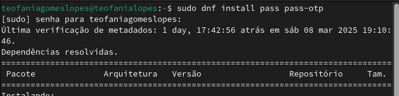{#fig:001 width=70%}

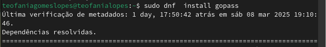{#fig:002 width=70%}

Создаю новый ключ GPG поскольку команда gpg --list-secret-keys ничего не выводила:

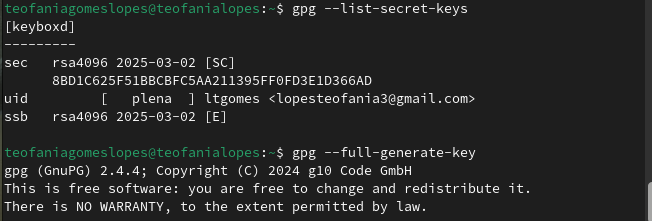{#fig:003 width=70%}

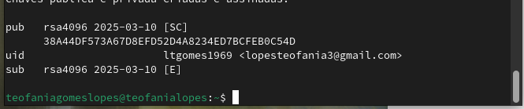{#fig:004 width=70%}

С помощью pass init, инициализирую хранилище указывая свой адрес электроной почты и создаю структуру git (pass git init) для синхронирования:

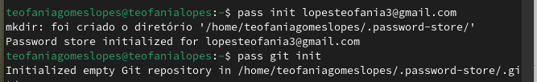{#fig:005 width=70%}

Перехожу в ~/.password-store для посмотра статуса синхронизации:

{#fig:006 width=70%}

## Настройка интерфейса с броузером

Добавляю плагин browserpass для firefox через броузера:

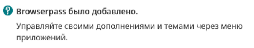{#fig:007 width=70%}

Для взаимодействия с броузером используется интерфейс native messaging. Поэтому кроме плагина к броузеру устанавливается программа, обеспечивающая интерфейс native messaging. Делаю это через терминала

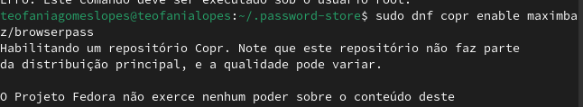{#fig:008 width=70%}

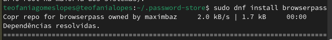{#fig:009 width=70%}

## Сохранение пароля

Добавляю новый пароль в файле, который будет использоваться для хранения пароля. Этот файл находится в каталоге, определяющее файловую структуру для вашего хранилища паролей.

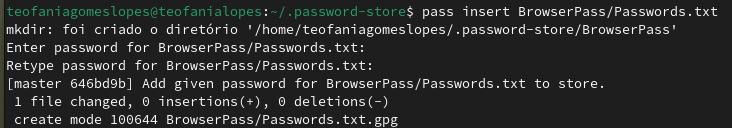{#fig:010 width=70%}

При запуске pass BrowserPass/Passwords.txt, выводится запрос подтвердить созданный пароль:

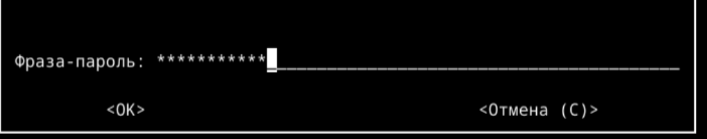{#fig:011 width=70%}

Заменяю существующий пароль с помощью pass generate --in-place Passwords.txt

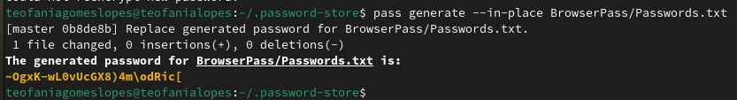{#fig:0012 width=70%}

## Управление файлами конфигурации

### Дополнительное программное обеспечение

Устанавливаю дополнительное программное обеспечение:

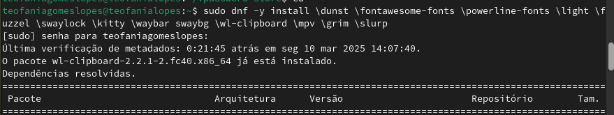{#fig:0013 width=70%}

Установливаю шрифты iosevka. Для этого надо включть copr peterwu/iosevka и искать iosevka:

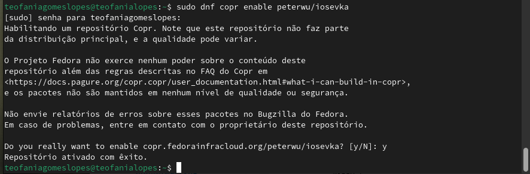{#fig:0014 width=70%}

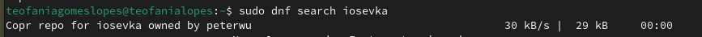{#fig:0015 width=70%}

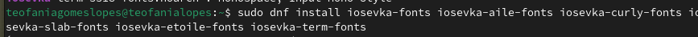{#fig:0016 width=70%}

## Установка бинарного файла

Скрипт определяет архитектуру процессора и операционную систему и скачивает необходимый файл, поэтому я просто запускаю sh -c "$(wget -qO- chezmoi.io/get)":

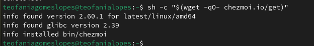{#fig:0017 width=70%}

## Создание собственного репозитория

С помощью утилита gh я создаю новый репозиторий dotfiles по шаблону yamadharma

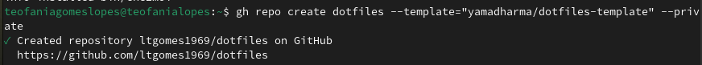{#fig:0018 width=70%}

## Подключение репозитория к своей системе

Сhezmoi является клоном репозитория dotfiles. Инициализирую его:

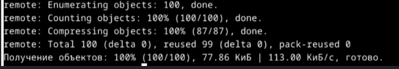{#fig:0019 width=70%}

Проверяю какие изменения внесёт chezmoi в домашний каталог, запуская chezmoi diff:

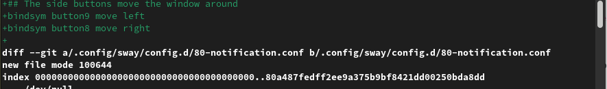{#fig:0020 width=70%}

Применяю изменения запускав chezmoi apply -v:

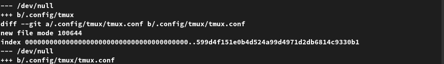{#fig:0021 width=70%}

## Использование chezmoi на нескольких машинах

На другой машине я устанавливаю chezmoi

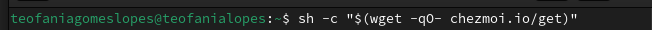{#fig:0022 width=70%}

Далее инициализирую chezmoi со своём репозиторием dotfiles:

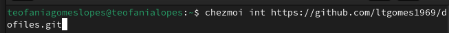{#fig:0023 width=70%}

Проверяю какие изменения внесёт chezmoi в домашний каталог, запуская chezmoi diff:

{#fig:0024 width=70%}

Применяю изменения запускав chezmoi apply -v:

{#fig:0025 width=70%}

Меня устраивают изменения, внесённые chezmoi, поэтомму я просто обновляю chezmoi :

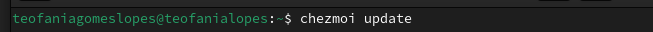{#fig:0026 width=70%}

## Ежедневные операции c chezmoi

На моей основной машине я обновляю chezmoi на всякий случай:

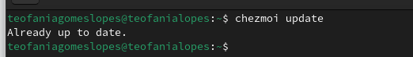{#fig:0027 width=70%}

Выполняю chezmoi git pull -- --autostash --rebase && chezmoi diff. Это запускается git pull --autostash --rebase в исходном каталоге, а chezmoi diff затем показывает разницу между целевым состоянием, вычисленным из исходного каталога, и фактическим состоянием.

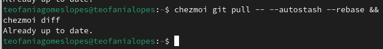{#fig:0028 width=70%}

Далее применяю "изменения":

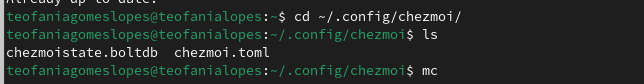{#fig:0029 width=70%}

Когда в исходный каталог вносятся изменения, chezmoi фиксирует изменения с помощью автоматически сгенерированного сообщения фиксации и отправляет их в репозиторий. Эта функция отключена по умолчанию но у меня уже была включено. Можно это увидеть в файле конфигурации ~/.config/chezmoi/chezmoi.toml:

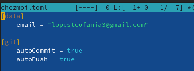{#fig:0030 width=70%}

# Выводы

При выполнении данной работы я настроила рабочую среду с помощью менеджера паролей pass и конфигурации chezmoi.

# Список литературы{.unnumbered}

::: {#refs}
:::
