---
## Front matter
title: "Отчёта по лабораторной работе 6"
subtitle: "Операционные системы"
author: "Гомес Лопес Теофания"

## Generic otions
lang: ru-RU
toc-title: "Содержание"

## Bibliography
bibliography: bib/cite.bib
csl: pandoc/csl/gost-r-7-0-5-2008-numeric.csl

## Pdf output format
toc: true # Table of contents
toc-depth: 2
lof: true # List of figures
lot: true # List of tables
fontsize: 12pt
linestretch: 1.5
papersize: a4
documentclass: scrreprt
## I18n polyglossia
polyglossia-lang:
  name: russian
  options:
	- spelling=modern
	- babelshorthands=true
polyglossia-otherlangs:
  name: english
## I18n babel
babel-lang: russian
babel-otherlangs: english
## Fonts
mainfont: IBM Plex Serif
romanfont: IBM Plex Serif
sansfont: IBM Plex Sans
monofont: IBM Plex Mono
mathfont: STIX Two Math
mainfontoptions: Ligatures=Common,Ligatures=TeX,Scale=0.94
romanfontoptions: Ligatures=Common,Ligatures=TeX,Scale=0.94
sansfontoptions: Ligatures=Common,Ligatures=TeX,Scale=MatchLowercase,Scale=0.94
monofontoptions: Scale=MatchLowercase,Scale=0.94,FakeStretch=0.9
mathfontoptions:
## Biblatex
biblatex: true
biblio-style: "gost-numeric"
biblatexoptions:
  - parentracker=true
  - backend=biber
  - hyperref=auto
  - language=auto
  - autolang=other*
  - citestyle=gost-numeric
## Pandoc-crossref LaTeX customization
figureTitle: "Рис."
tableTitle: "Таблица"
listingTitle: "Листинг"
lofTitle: "Список иллюстраций"
lotTitle: "Список таблиц"
lolTitle: "Листинги"
## Misc options
indent: true
header-includes:
  - \usepackage{indentfirst}
  - \usepackage{float} # keep figures where there are in the text
  - \floatplacement{figure}{H} # keep figures where there are in the text
---

# Цель работы

Приобретение практических навыков взаимодействия пользователя с системой по средством командной строки.

# Задание

1. Определить полное имя домашнего каталога.
2. Выполнить некоторые действия.
3. Определить опции команды с помощью man.
4. Использовать команду history.

# Выполнение лабораторной работы

## Определение полного имени домашнего каталога.

Для определения полного имени каталога я использую команду pwd. Выводится, что я в домашнем каталоге

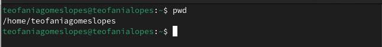{#fig:001 width=70%}

## Выполнение некоторых действиях.

Далее с помошью cd я перехожу в каталог /tmp и вывожу на экран содержимое каталога с помощью ls:

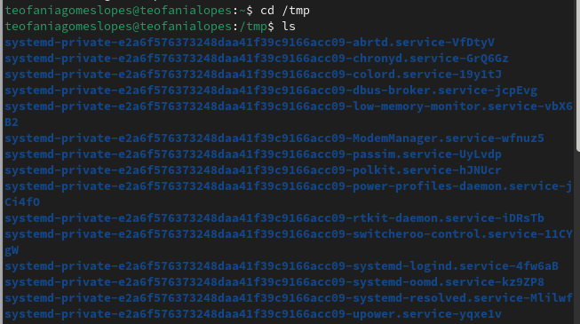{#fig:002 width=70%}

Вывожу на экран содержимое каталога с помощью ls -l, чтобы вывести на экран подробную информацию о файлах и каталогах (тип файла, право доступа, число ссылок, владелец, размер, дата последней ревизии, имя файла или каталога.):

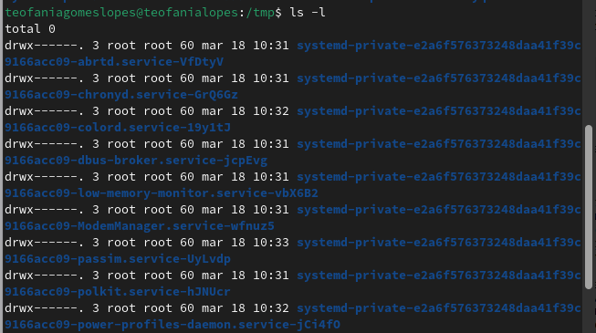{#fig:003 width=70%}

Вывожу на экран содержимое каталога с ls -F, для получение информацию о типах файлов (каталог, исполняемый файл, ссылка):

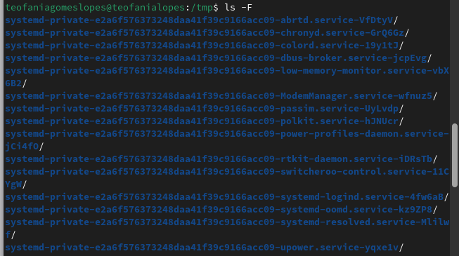{#fig:004 width=70%}

Вывожу на экран содержимое каталога с ls -a, чтобы отобразить скрытых от просмотра файлов:

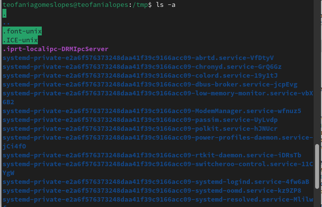{#fig:005 width=70%}

Я перехожу в каталог /var/spool/ и вывожу на экран содержимое каталога с помощью ls. Вижу, что в нем есть подкаталог cron:

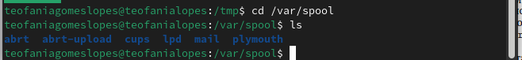{#fig:006 width=70%}

Перехожу в домашний каталог и вывожу содержиемое с помощью ls -l. Видно, что mwakutaipa является владельцем файлов и подкаталогов: 

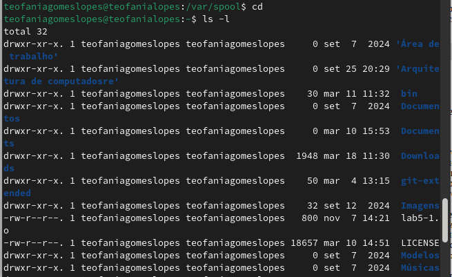{#fig:007 width=70%}

В домашнем каталоге создаю новый каталог с именем newdir и в этом же каталоге создайте новый каталог с именем morefun одной командой. Далее использую ls, чтобы проверять:

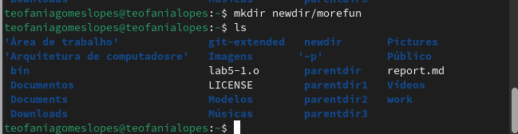{#fig:008 width=70%}

Создаю одной командой еще три новых каталога с именами letters, memos, misk и проверяю создание:

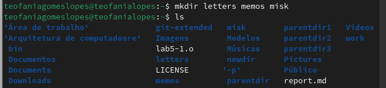{#fig:009 width=70%}

Удаляю эти каталоги одной командой rmdir и проверяю:

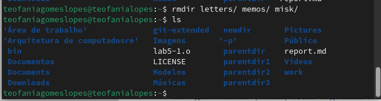{#fig:0010 width=70%}

Удаляю каталог ~/newdir/morefun из домашнего каталога и проверяю, был ли каталог удалён:

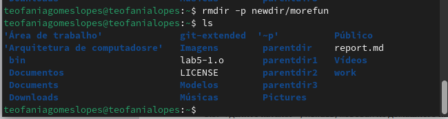{#fig:0011 width=70%}

## Определение опции команды с помощью man.

С помощью команды man определяю, какую опцию команды ls нужно использовать для просмотра содержимое не только указанного каталога, но и подкаталогов, входящих в него. Это является опцией -R:

{#fig:0012 width=70%}

Определяю набор опций команды ls, позволяющий отсортировать по времени последнего изменения выводимый список содержимого каталога с развёрнутым описанием файлов. Это является опцией -с:

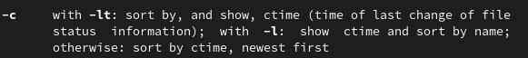{#fig:0013 width=70%}

С помощью man cd, узнаю описание cd и ее опции. -L  переходить по символическим ссылкам после того, как обработаны все переходы. -P позволяет следовать по символическим ссылкам перед тем, как обработаны все переходы. -e позволяет выйти с ошибкой, если директория, в которую нужно перейти, не найдена.

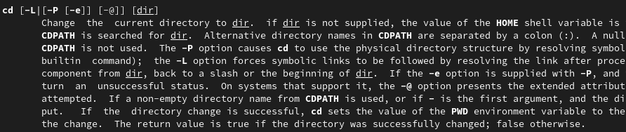{#fig:0014 width=70%}

С помощью man pwd узнаю описание команду и ее опции. -L - брать директорию из переменной окружения. -P - отрасывать все символические ссылки. 

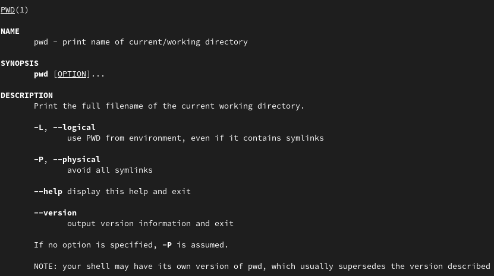{#fig:0015 width=70%}

Описание опции mkdir: -m -- устанавливается права доступа.  -p -- рекурсивнно создать каталог и подкаталоги. -v -- сообшается о созданных директориях. -z -- устанавливается SELinux для создаваемой директории по умолчанию.

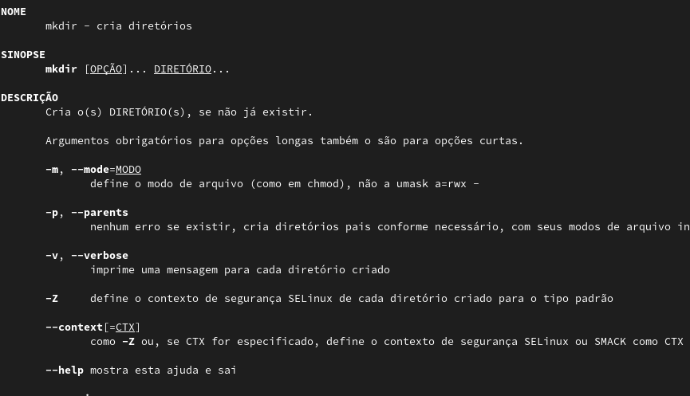{#fig:0016 width=70%}

Описание опции rmdir: --ignore-fail-on-non-empty -- отмняет вывод ошибки если каталог не пустой. -p -- удалить рекурсивнно каталог и подкаталоги. -v -- выводить сообшение о каждом удаленный директории.

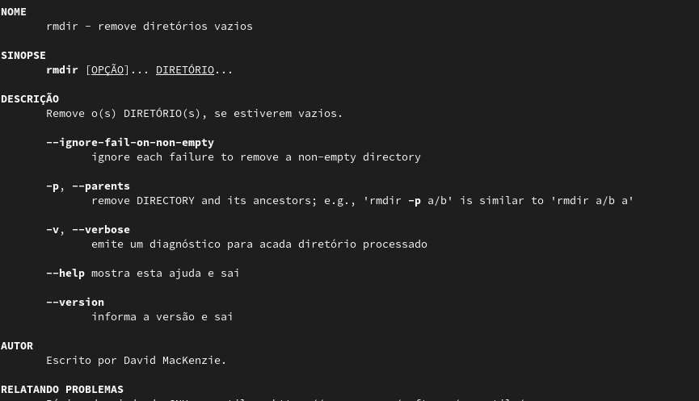{#fig:0017 width=70%}

Описание опции rm: -f -- игнорировать несуществующие файлы и аргументы, не выводит запрос на подтверждение удаления. -i -- выводит запрос на подтверждение удаления  -I -- выводит один раз запрос на подтверждение удаления если удаление рекурсивнно или больше 3 раза

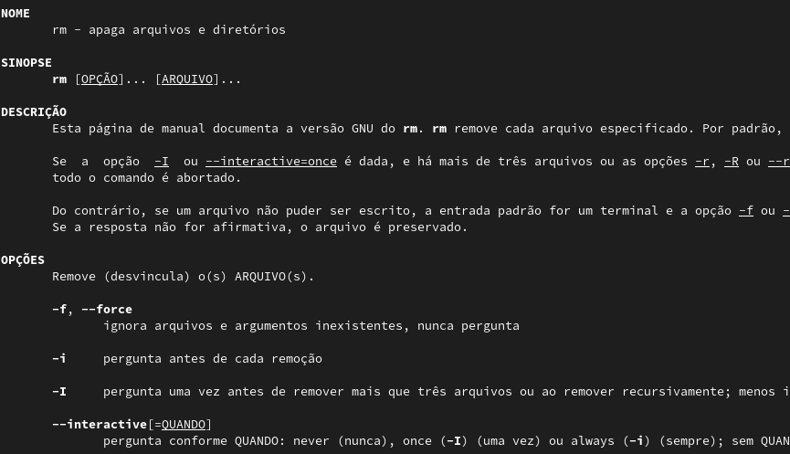{#fig:0018 width=70%}

## Использование команду history.

Используя информацию, полученную при помощи команды history: 

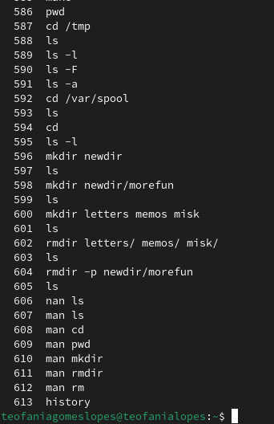{#fig:0019 width=70%}

Выполняю модификацию и исполнение нескольких команд из буфера команд: 

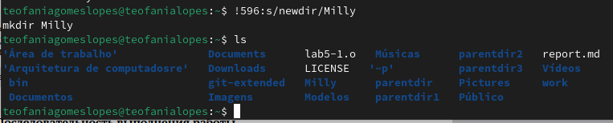{#fig:0021 width=70%}

# Выводы

При выполнении данной работы я приобретела практические навыки взаимодействия пользователя с системой по средством командной строки.

# Ответы на контрольные вопросы

1. Текстовая система, которая передает комманды компьютеру и возврашает результаты пользователю.

2. pwd. Пример: если я нохожусь в своем домашнем каталоге и запускаю pwd в командной строке , то я увижу результат /home/mwakutaipa.

3. ls с опцией -F. Например:

{#fig:0023 width=70%}

4. ls с опцией -а. Например:

{#fig:0024 width=70%}

5. rmdir по умолчанию удаляет пустые каталоги, не удаляет файлы. rm удаляет файлы, без дополнительных опций (-d, -r) не будет удалять каталоги. Удалить в одной строчке одной командой можно файл и каталог. Если файл находится в каталоге, используем рекурсивное удаление, если файл и каталог не связаны подобным образом, то добавим опцию -d, введя имена через пробел после утилиты.

6. Вывести информацию о последних выполненных пользователем команд можно с помощью history. Пример:

{#fig:0025 width=70%}

7. Используем синтаксиси !номер команды в выводе history:s/что заменяем/на что заменяем Примеры:

{#fig:0026 width=70%}

8. Если я введу "cd ; ls" в домашнем каталоге, то окажусь в домашнем каталоге и получу вывод файлов внутри него.

9. Символ экранирования - (обратный слеш) добавление перед спецсимволом обратный слеш, чтобы использовать специальный символ как обычный. Также позволяет читать системе название директорий с пробелом. Пример: cd work/Операционные\ системы/

10. Опция -l позволит увидеть дополнительную информацию о файлах в каталоге: время создания, владельца, права доступа

11. Относительный путь к файлу начинается из той директории, где вы находитесь (она сама не прописывается в пути), он прописывается относительно данной директории. Абсолютный путь начинается с корневого каталога.

12. Использовать man <имя команды> или <имя команды> --help

13. Клавиша Tab.

# Список литературы{.unnumbered}

::: {#refs}
:::
