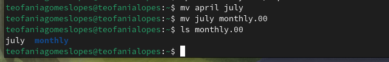
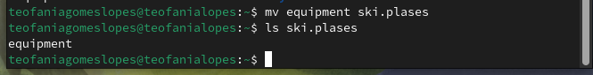
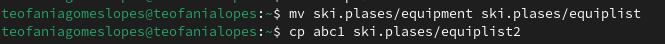
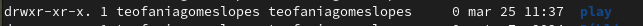
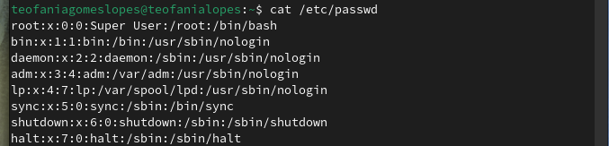
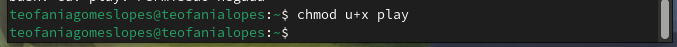

---
## Front matter
lang: ru-RU
title: Структура по лабораторной работе 7
subtitle: Архиттектура компьютеров и операционные системы
author:
  - Гомес Лопес Теофания
institute:
  - Российский университет дружбы народов, Москва, Россия
date: 25 марта 2025

## i18n babel
babel-lang: russian
babel-otherlangs: english

## Formatting pdf
toc: false
toc-title: Содержание
slide_level: 2
aspectratio: 169
section-titles: true
theme: metropolis
header-includes:
 - \metroset{progressbar=frametitle,sectionpage=progressbar,numbering=fraction}
---

## Цель работы

Ознакомление с файловой системой Linux, её структурой, именами и содержанием каталогов. Приобретение практических навыков по применению команд для работы с файлами и каталогами, по управлению процессами (и работами), по проверке использования диска и обслуживанию файловой системы.

# Задание

1. Команды для работы с файлами и каталогами
2. Анализ файловой системы Linux.

# Выполнение лабораторной работы

# Цель работы

Ознакомление с файловой системой Linux, её структурой, именами и содержанием каталогов. Приобретение практических навыков по применению команд для работы с файлами и каталогами, по управлению процессами (и работами), по проверке использования диска и обслуживанию файловой системы.

# Задание

1. Команды для работы с файлами и каталогами
2. Анализ файловой системы Linux.

## Работа с файлами и каталогами

Создаю файл abc1 с помощью touch и копирую его с новыми именами april и may исползуя cp:

{#fig:001 width=70%}

## Работа с файлами и каталогами

Создаю каталог monthly и копирую april и may в нем исползуя cp. Проверяю с ls:

{#fig:002 width=70%}

## Работа с файлами и каталогами

Копирую каталог monthly в каталог monthly.00 с помощью опции cp -r:

{#fig:004 width=70%}

## Работа с файлами и каталогами

Изменяю название файла april на july в домашнем каталоге и перемещаю файл july в каталог monthly.00:

{#fig:006 width=70%}

## Работа с файлами и каталогами

 Перемещаю файл equipment в каталог ~/ski.plases:

{#fig:0011 width=70%}

## Работа с файлами и каталогами

Переименую файл ~/ski.plases/equipment в ~/ski.plases/equiplist и копирую abc1 в каталог ~/ski.plases, назову его equiplist2:

{#fig:0012 width=70%}
## Работа с файлами и каталогами

Создаю каталог с именем equipment в каталоге ~/ski.plases и перемещаю файлы ~/ski.plases/equiplist и equiplist2 в каталог ~/ski.plases/equipment:

{#fig:0013 width=70%}

## Работа с файлами и каталогами

Создаю каталог australia. Удаляю права на исполнение для группы (g-x) и владелца(u-x):

{#fig:0015 width=70%}

## Работа с файлами и каталогами

{#fig:0016 width=70%}

## Работа с файлами и каталогами

Изменяю права доступа к каталогу play и проверяю:

{#fig:0017 width=70%}

## Работа с файлами и каталогами

{#fig:0018 width=70%}

## Работа с файлами и каталогами

Изменяю права доступа к файлу feathers и проверяю:

{#fig:0019 width=70%}

## Работа с файлами и каталогами

 Смотрю содержимое файла /etc/passwd:

{#fig:0020 width=70%}

## Работа с файлами и каталогами

Лишаю пользователя файла ~/feathers права на чтение:

{#fig:0023 width=70%}

## Работа с файлами и каталогами

Когда я попытаюсь просмотреть файл ~/feathers командой cat, система запрешает мне:

{#fig:0024 width=70%}

## Работа с файлами и каталогами

Лишаю владельца каталога ~/play права на выполнение. Когда я попробую перейти в этот же каталог, система запрешает мне:

{#fig:0025 width=70%}

## Работа с файлами и каталогами

Даю владельцу каталога ~/play право на выполнение:

{#fig:0026 width=70%}

## Работа с файлами и каталогами

С помощью man прочитаю по следующим командам:
mount — утилита командной строки в UNIX-подобных операционных системах.

{#fig:0027 width=70%}

# Выводы

При выполнении данной лабораторной работы я ознакомилась с файловой системой Linux, её структурой, именами и содержанием каталогов. 

