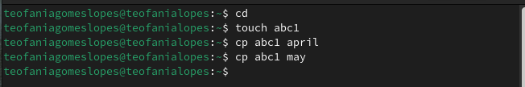
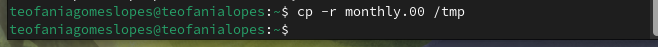
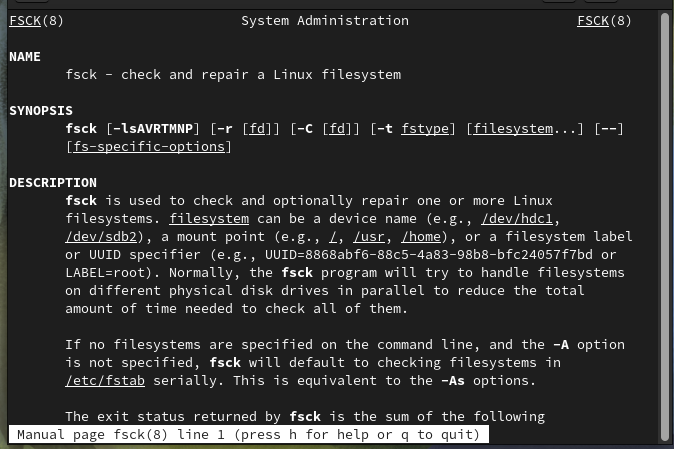

---
## Front matter
title: "Отчёта по лабораторной работе 7"
subtitle: "Операционные системы"
author: "Гомес Лопес Теофания"

## Generic otions
lang: ru-RU
toc-title: "Содержание"

## Bibliography
bibliography: bib/cite.bib
csl: pandoc/csl/gost-r-7-0-5-2008-numeric.csl

## Pdf output format
toc: true # Table of contents
toc-depth: 2
lof: true # List of figures
lot: true # List of tables
fontsize: 12pt
linestretch: 1.5
papersize: a4
documentclass: scrreprt
## I18n polyglossia
polyglossia-lang:
  name: russian
  options:
	- spelling=modern
	- babelshorthands=true
polyglossia-otherlangs:
  name: english
## I18n babel
babel-lang: russian
babel-otherlangs: english
## Fonts
mainfont: IBM Plex Serif
romanfont: IBM Plex Serif
sansfont: IBM Plex Sans
monofont: IBM Plex Mono
mathfont: STIX Two Math
mainfontoptions: Ligatures=Common,Ligatures=TeX,Scale=0.94
romanfontoptions: Ligatures=Common,Ligatures=TeX,Scale=0.94
sansfontoptions: Ligatures=Common,Ligatures=TeX,Scale=MatchLowercase,Scale=0.94
monofontoptions: Scale=MatchLowercase,Scale=0.94,FakeStretch=0.9
mathfontoptions:
## Biblatex
biblatex: true
biblio-style: "gost-numeric"
biblatexoptions:
  - parentracker=true
  - backend=biber
  - hyperref=auto
  - language=auto
  - autolang=other*
  - citestyle=gost-numeric
## Pandoc-crossref LaTeX customization
figureTitle: "Рис."
tableTitle: "Таблица"
listingTitle: "Листинг"
lofTitle: "Список иллюстраций"
lotTitle: "Список таблиц"
lolTitle: "Листинги"
## Misc options
indent: true
header-includes:
  - \usepackage{indentfirst}
  - \usepackage{float} # keep figures where there are in the text
  - \floatplacement{figure}{H} # keep figures where there are in the text
---

## Цель работы

Ознакомление с файловой системой Linux, её структурой, именами и содержанием каталогов. Приобретение практических навыков по применению команд для работы с файлами и каталогами, по управлению процессами (и работами), по проверке использования диска и обслуживанию файловой системы.

# Задание

1. Команды для работы с файлами и каталогами
2. Анализ файловой системы Linux.

# Выполнение лабораторной работы

## Команды для работы с файлами и каталогами

Создаю файл abc1 с помощью touch и копирую его с новыми именами april и may исползуя cp:

{#fig:001 width=70%}

Создаю каталог monthly и копирую april и may в нем исползуя cp. Проверяю с ls:

{#fig:002 width=70%}

В каталоге monthly копирую файл may с именем june исползуя cp:

{#fig:003 width=70%}

Копирую каталог monthly в каталог monthly.00 с помощью опции cp -r:

{#fig:004 width=70%}

Копирую каталог monthly.00 в каталог /tmp:

{#fig:005 width=70%}

Изменяю название файла april на july в домашнем каталоге и перемещаю файл july в каталог monthly.00:

{#fig:006 width=70%}

Переименовываю каталог monthly.00 в monthly.01. Перемещаю каталог monthly.01 в каталог reports:

{#fig:007 width=70%}

Переименовываю каталог reports/monthly.01 в reports/monthly:

{#fig:008 width=70%}

Копирую файл /usr/include/sys/io.h в домашний каталог и назову его equipment:

{#fig:009 width=70%}

В домашнем каталоге создаю директорию ~/ski.plases с помощью mkdir:

{#fig:0010 width=70%}

 Перемещаю файл equipment в каталог ~/ski.plases:

{#fig:0011 width=70%}

Переименую файл ~/ski.plases/equipment в ~/ski.plases/equiplist и копирую abc1 в каталог ~/ski.plases, назову его equiplist2:

{#fig:0012 width=70%}

Создаю каталог с именем equipment в каталоге ~/ski.plases и перемещаю файлы ~/ski.plases/equiplist и equiplist2 в каталог ~/ski.plases/equipment:

{#fig:0013 width=70%}

Создаю и перемещаю каталог ~/newdir в каталог ~/ski.plases и назову его plans:

{#fig:0014 width=70%}

Создаю каталог australia. Удаляю права на исполнение для группы (g-x) и владелца(u-x):

{#fig:0015 width=70%}

{#fig:0016 width=70%}

Изменяю права доступа к каталогу play и проверяю:

{#fig:0017 width=70%}

{#fig:0018 width=70%}

Изменяю права доступа к файлу feathers и проверяю:

{#fig:0019 width=70%}

 Смотрю содержимое файла /etc/passwd:

{#fig:0020 width=70%}

Копирую файл ~/feathers в файл ~/file.old, перемещаю файл ~/file.old в каталог ~/play и копирую каталог ~/play в каталог ~/fun:

{#fig:0021 width=70%}

Перемещаю каталог ~/fun в каталог ~/play и назову его games

{#fig:0022 width=70%}

Лишаю пользователя файла ~/feathers права на чтение:

{#fig:0023 width=70%}

Когда я попытаюсь просмотреть файл ~/feathers командой cat, система запрешает мне:

{#fig:0024 width=70%}

Лишаю владельца каталога ~/play права на выполнение. Когда я попробую перейти в этот же каталог, система запрешает мне:

{#fig:0025 width=70%}

Даю владельцу каталога ~/play право на выполнение:

{#fig:0026 width=70%}

С помощью man прочитаю по следующим командам:
mount — утилита командной строки в UNIX-подобных операционных системах. Применяется для монтирования файловых систем.

{#fig:0027 width=70%}

fsck (проверка файловой системы) - это утилита командной строки, которая позволяет выполнять проверки согласованности и интерактивное исправление в одной или нескольких файловых системах Linux. Он использует программы, специфичные для типа файловой системы, которую он проверяет.

{#fig:0028 width=70%}

mkfs используется для создания файловой системы Linux на некотором устройстве, обычно в разделе жёсткого диска. В качестве аргумента filesys для файловой системы может выступать или название устройства

{#fig:0029 width=70%}

Команда Kill посылает указанный сигнал указанному процессу. Если не указано ни одного сигнала, посылается сигнал SIGTERM. Сигнал SIGTERM завершает лишь те процессы, которые не обрабатывают его приход. Для других процессов может быть необходимым послать сигнал SIGKILL, поскольку этот сигнал перехватить невозможно.

{#fig:0030 width=70%}

# Выводы

При выполнении данной лабораторной работы я ознакомилась с файловой системой Linux, её структурой, именами и содержанием каталогов. Приобрела практические навыки по применению команд для работы с файлами и каталогами, по управлению процессами (и работами), по проверке использования диска и обслуживанию файловой системы.
