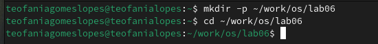
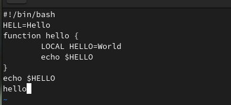
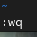
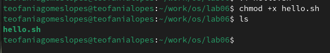
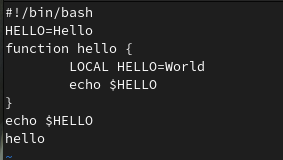
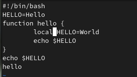
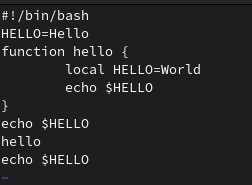
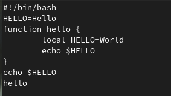

---
## Front matter
lang: ru-RU
title: Структура по лабораторной работе 10
subtitle: Архиттектура компьютеров и операционные системы
author:
  - Гомес Лопес Теофания
institute:
  - Российский университет дружбы народов, Москва, Россия
date: 13 апреля 2025

## i18n babel
babel-lang: russian
babel-otherlangs: english

## Formatting pdf
toc: false
toc-title: Содержание
slide_level: 2
aspectratio: 169
section-titles: true
theme: metropolis
header-includes:
 - \metroset{progressbar=frametitle,sectionpage=progressbar,numbering=fraction}
---

# Цель работы

Получить практические навыки работы с редактором vi, установленным по умолчанию практически во всех дистрибутивах Linux.

# Задание

  1. Создание нового файла с использованием vi
  2. Редактирование существующего файла

# Выполнение лабораторной работы

## Создание нового файла с использованием vi

Снчала я создала каталог с именем ~/work/os/lab06 и перешла в нем:

{#fig:001 width=70%}

## Создание нового файла с использованием vi

Вызвала vi и создала файл hello.sh одновременно. Перешла в режим вставки с помощью клавиши i и вводила текст:

{#fig:002 width=70%}

## Создание нового файла с использованием vi

Используя клавиши esc я перешла в команднный режим, затем нажимала : для перехода в режим последней строки. Затем я записала и вышла из vi используя w, q и enter:

{#fig:003 width=70%}

## Создание нового файла с использованием vi

С помощью chmod +х создаю исполняемый файл:

{#fig:004 width=70%}

## Редактирование существующего файла

Вызвала vi на редактирование файла, установила курсор в конец слова HELL второй строки. Далее я перешла в режим вставки и заменила на HELLO.

{#fig:005 width=70%}

## Редактирование существующего файла

Я перешла в режим вставки с помощью клавишы i, установила курсор на четвертую строку и сотрила слово LOCAL, перешла в режим вставки и вводила текст local. 

{#fig:006 width=70%}

## Редактирование существующего файла

Я перешла в режим вставки, установила курсор на последней строке файла и вставила после неё строку, содержащую текст echo $HELLO.

{#fig:007 width=70%}

## Редактирование существующего файла

Я удалила последнюю строку:

{#fig:008 width=70%}

## Редактирование существующего файла

С помощью клавиши u, я отменила последнее действие.

{#fig:009 width=70%}

## Редактирование существующего файла

Опции редактора vi позволяют настроить рабочую среду. 
– : set all — вывести полный список опций;
– : set nu — вывести номера строк;
– : set list — вывести невидимые символы;
– : set ic — не учитывать при поиске, является ли символ прописным или строчным.

# Выводы

При выполнении данной работы я получила практические навыки работы с редактором vi.
