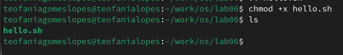
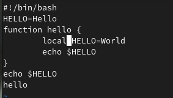

---
## Front matter
title: "Отчёта по лабораторной работе 10"
subtitle: "Операционные системы"
author: "Гомес Лопес Теофания"

## Generic otions
lang: ru-RU
toc-title: "Содержание"

## Bibliography
bibliography: bib/cite.bib
csl: pandoc/csl/gost-r-7-0-5-2008-numeric.csl

## Pdf output format
toc: true # Table of contents
toc-depth: 2
lof: true # List of figures
lot: true # List of tables
fontsize: 12pt
linestretch: 1.5
papersize: a4
documentclass: scrreprt
## I18n polyglossia
polyglossia-lang:
  name: russian
  options:
	- spelling=modern
	- babelshorthands=true
polyglossia-otherlangs:
  name: english
## I18n babel
babel-lang: russian
babel-otherlangs: english
## Fonts
mainfont: IBM Plex Serif
romanfont: IBM Plex Serif
sansfont: IBM Plex Sans
monofont: IBM Plex Mono
mathfont: STIX Two Math
mainfontoptions: Ligatures=Common,Ligatures=TeX,Scale=0.94
romanfontoptions: Ligatures=Common,Ligatures=TeX,Scale=0.94
sansfontoptions: Ligatures=Common,Ligatures=TeX,Scale=MatchLowercase,Scale=0.94
monofontoptions: Scale=MatchLowercase,Scale=0.94,FakeStretch=0.9
mathfontoptions:
## Biblatex
biblatex: true
biblio-style: "gost-numeric"
biblatexoptions:
  - parentracker=true
  - backend=biber
  - hyperref=auto
  - language=auto
  - autolang=other*
  - citestyle=gost-numeric
## Pandoc-crossref LaTeX customization
figureTitle: "Рис."
tableTitle: "Таблица"
listingTitle: "Листинг"
lofTitle: "Список иллюстраций"
lotTitle: "Список таблиц"
lolTitle: "Листинги"
## Misc options
indent: true
header-includes:
  - \usepackage{indentfirst}
  - \usepackage{float} # keep figures where there are in the text
  - \floatplacement{figure}{H} # keep figures where there are in the text
---

# Цель работы

Получить практические навыки работы с редактором vi, установленным по умолчанию практически во всех дистрибутивах Linux.

# Задание

  1. Создание нового файла с использованием vi
  2. Редактирование существующего файла

# Выполнение лабораторной работы

## Создание нового файла с использованием vi

Снчала я создала каталог с именем ~/work/os/lab06 и перешла в нем:

{#fig:001 width=70%}

Вызвала vi и создала файл hello.sh одновременно. Перешла в режим вставки с помощью клавиши i и вводила текст:

{#fig:002 width=70%}

Используя клавиши esc я перешла в команднный режим, затем нажимала : для перехода в режим последней строки. Затем я записала и вышла из vi используя w, q и enter:

{#fig:003 width=70%}

С помощью chmod +х создаю исполняемый файл:

{#fig:004 width=70%}

## Редактирование существующего файла

Вызвала vi на редактирование файла, установила курсор в конец слова HELL второй строки. Далее я перешла в режим вставки и заменила на HELLO. После этого я вернулась в командный режим:

{#fig:005 width=70%}

Я перешла в режим вставки с помощью клавишы i, установила курсор на четвертую строку и сотрила слово LOCAL, перешла в режим вставки и вводила текст local. После этого я вернулась в командный режим:

{#fig:006 width=70%}

Я перешла в режим вставки, установила курсор на последней строке файла и вставила после неё строку, содержащую текст echo $HELLO. Далее перешла в командный режим:

{#fig:007 width=70%}

Я удалила последнюю строку:

{#fig:008 width=70%}

С помощью клавиши u, я отменила последнее действие. Я нажимала : для перехода в режим последней строки и вышла из vi:

{#fig:009 width=70%}

# Выводы

При выполнении данной работы я получила практические навыки работы с редактором vi.

# Ответы на контрольные вопросы

1. командный режим — предназначен для ввода команд редактирования и навигации по редактируемому файлу;
   режим вставки — предназначен для ввода содержания редактируемого файла;
   режим последней (или командной) строки — используется для записи изменений в файл и выхода из редактора.
   
2. Можно нажимать символ q (или q!), если требуется выйти из редактора без сохранения.

3. 0 (ноль) — переход в начало строки; $ — переход в конец строки; G — переход в конец файла; n G — переход на строку с номером n.
4. Редактор vi предполагает, что слово - это строка символов, которая может включать в себя буквы, цифры и символы подчеркивания.

5. С помощью G — переход в конец файла

6. Вставка текста – а — вставить текст после курсора; – А — вставить текст в конец строки; – i — вставить текст перед курсором; – n i — вставить текст n раз; – I — вставить текст в начало строки. Вставка строки – о — вставить строку под курсором; – О — вставить строку над курсором. Удаление текста – x — удалить один символ в буфер; – d w — удалить одно слово в буфер; – d $ — удалить в буфер текст от курсора до конца строки; – d 0 — удалить в буфер текст от начала строки до позиции курсора; – d d — удалить в буфер одну строку; – n d d — удалить в буфер n строк.Отмена и повтор произведённых изменений – u — отменить последнее изменение; – . — повторить последнее изменение.Копирование текста в буфер – Y — скопировать строку в буфер; – n Y — скопировать n строк в буфер; – y w — скопировать слово в буфер.Вставка текста из буфера – p — вставить текст из буфера после курсора; – P — вставить текст из буфера перед курсором. Замена текста – c w — заменить слово; – n c w — заменить n слов; – c $ — заменить текст от курсора до конца строки; – r — заменить слово; – R — заменить текст. Поиск текста – / текст — произвести поиск вперёд по тексту указанной строки символов текст; – ? текст — произвести поиск назад по тексту указанной строки символов текст.

7. Перейти в режим вставки.

8. С помощью u — отменить последнее изменение

9. Режим последней строки — используется для записи изменений в файл и выхода из редактора.

10. $ — переход в конец строки

11. Опции редактора vi позволяют настроить рабочую среду. Для задания опций используется команда set (в режиме последней строки): – : set all — вывести полный список опций; – : set nu — вывести номера строк; – : set list — вывести невидимые символы; – : set ic — не учитывать при поиске, является ли символ прописным или строчным.

12. В редакторе vi есть два основных режима: командный режим и режим вставки. По умолчанию работа начинается в командном режиме. В режиме вставки клавиатура используется для набора текста. Для выхода в командный режим используется клавиша Esc или комбинация Ctrl + c.

# Список литературы{.unnumbered}

::: {#refs}
:::
