---
## Front matter
lang: ru-RU
title: Структура по лабораторной работе 11
subtitle: Архиттектура компьютеров и операционные системы
author:
  - Гомес Лопес Теофания
institute:
  - Российский университет дружбы народов, Москва, Россия
date: 22 апреля 2025

## i18n babel
babel-lang: russian
babel-otherlangs: english

## Formatting pdf
toc: false
toc-title: Содержание
slide_level: 2
aspectratio: 169
section-titles: true
theme: metropolis
header-includes:
 - \metroset{progressbar=frametitle,sectionpage=progressbar,numbering=fraction}
---

# Цель работы

Получить практические навыки работы с редактором Emacs.

# Задание

1. Выполнить основные команды emacs

# Выполнение лабораторной работы

Для данной работы, мне надо была установить Emacs:

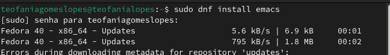{#fig:001 width=70%}

## Основные кманды с редактором

Выполнив Emacs в командной строке, я открыла текстовый редактор:

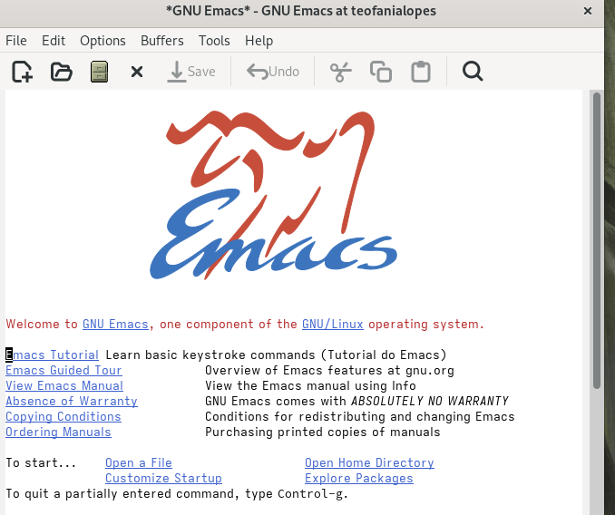{#fig:002 width=70%}

## Основные кманды с редактором

С помощью комбинации Ctrl-x Ctrl-f, создала файл lab07.sh:

{#fig:003 width=70%}

## Основные кманды с редактором

Я написала некоторый текст в этом же файле (lab07.sh). 

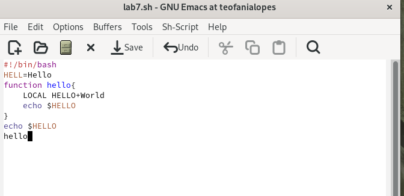{#fig:004 width=70%}

## Основные кманды с редактором

Одной командой вырезала целую строку (С-k):

{#fig:005 width=70%}

## Основные кманды с редактором

С помощью C-y вставила эту строку в конец файла:

{#fig:006 width=70%}

## Основные кманды с редактором

Выделила область текста (C-space):

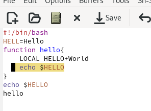{#fig:007 width=70%}

## Основные кманды с редактором

Скопировала область в буфер обмена (M-w) и вставила ее в конец файла:

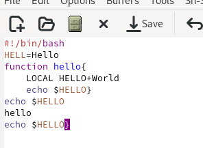{#fig:008 width=70%}

## Основные кманды с редактором

Выделила эту же область и на этот раз вырезала её (C-w):

{#fig:009 width=70%}

## Основные кманды с редактором

С помощью C-/ отменила последнее действие:

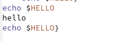{#fig:0010 width=70%}

## Основные кманды с редактором

С помощью C-e переместила курсор в конец строки:

{#fig:0012 width=70%}

## Основные кманды с редактором

Переместила курсор в начало и конец буфера с помощью M-< и M-> соответственно:

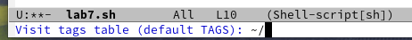{#fig:0013 width=70%}

## Основные кманды с редактором

Выводила список активных буферов на экран с помощью C-x C-b:

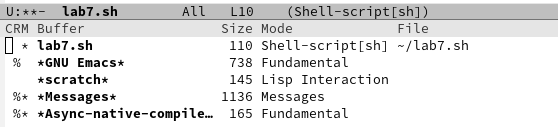{#fig:0014 width=70%}

## Основные кманды с редактором

С помощью C-x o переместилась во вновь открытое окно со списком открытых буферов и переключилась на другой буфер:

{#fig:0015 width=70%}

## Основные кманды с редактором

С помощью C-x 0 закрыла окно со списком открытых буферов:

{#fig:0016 width=70%}

## Основные кманды с редактором

Без вывода списка буферов, я переключилась между буферами

{#fig:0017 width=70%}

## Основные кманды с редактором

{#fig:0018 width=70%}

## Основные кманды с редактором

Поделила фрейм на 4 части. 

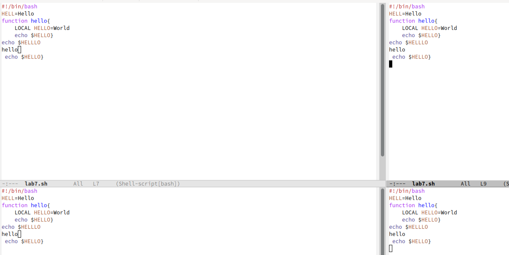{#fig:0019 width=70%}

## Основные кманды с редактором

В каждом из четырёх созданных окон открыла новый буфер: 

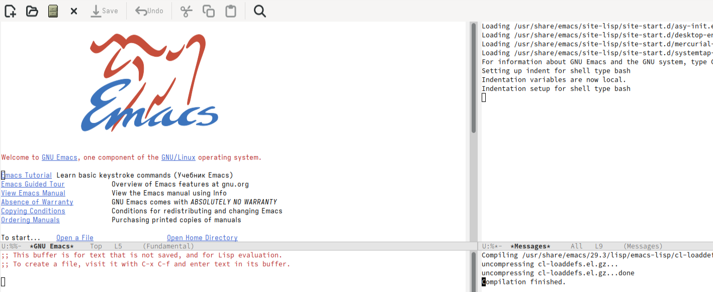{#fig:0020 width=70%}

## Основные кманды с редактором

Переключилась в режим поиска (C-s) и искала Indent:

{#fig:0021 width=70%}

## Основные кманды с редактором

Переключалась между результатами поиска, нажимая C-s и вышла из режима поиска, нажав C-g:

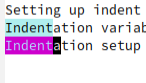{#fig:0022 width=70%}

## Основные кманды с редактором

Перешла в режим поиска и замены (M-%), искала слово World, нажмала Enter, и заменила на Planet:

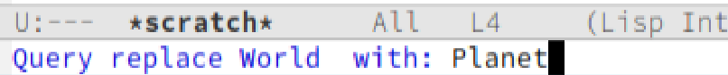{#fig:0023 width=70%}

## Основные кманды с редактором

Нажав M-s o, я использовала другой режим поиска. Он отличается от предыдущего тем, что выводит результаты поиска в новом окне:

{#fig:0024 width=70%}

## Основные кманды с редактором

{#fig:0025 width=70%}

# Выводы

При выполнение данной работы я получила практические навыки работы с Emacs.

