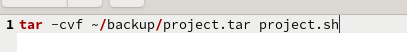
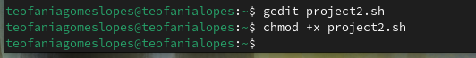

---
## Front matter
lang: ru-RU
title: Структура по лабораторной работе 5
subtitle: Архиттектура компьютеров и операционные системы
author:
  - Гомес Лопес Теофания
institute:
  - Российский университет дружбы народов, Москва, Россия
date: 28 апреля 2025

## i18n babel
babel-lang: russian
babel-otherlangs: english

## Formatting pdf
toc: false
toc-title: Содержание
slide_level: 2
aspectratio: 169
section-titles: true
theme: metropolis
header-includes:
 - \metroset{progressbar=frametitle,sectionpage=progressbar,numbering=fraction}
---

# Цель работы

Научиться писать небольшие командные файлы.


# Задание


# Выполнение лабораторной работы

Я создала файл project.sh. 

{#fig:001 width=70%}

## Выполнение работы

{#fig:002 width=70%}

## Выполнение работы

{#fig:003 width=70%}

## Выполнение работы

{#fig:004 width=70%}

## Выполнение работы

Я проверила с помощью cat,что копия содержит скрипт из оригинала:

{#fig:005 width=70%}


## Выполнение работы


Создала другой файл project1.sh. Написала код, обрабатывающий любое произвольное число аргументов командной строки. Сделала его исполняемый и запускала его:

{#fig:006 width=70%}

{#fig:007 width=70%}


## Выполнение работы

```
for A in $*
	do echo $A
done
```

{#fig:008 width=70%}


## Выполнение работы

Создала файл project2.sh и в нем написала программу - аналог команды ls. Она выводит информацию о возможностях доступа к файлам этого каталога и  информацию о нужном каталоге:

{#fig:009 width=70%}

## Выполнение работы

{#fig:0010 width=70%}


## Выполнение работы

Создала файл project3.sh и в нем написала код, который олучает в качестве аргумента командной строки формат файла (.txt, .doc, .jpg, .pdf и т.д.) и вычисляет количество таких файлов в указанной директории.

{#fig:0012 width=70%}

## Выполнение работы

{#fig:0013 width=70%}


# Выводы

При выполнении данной работы я научилась писать небольшие командные файлы.

