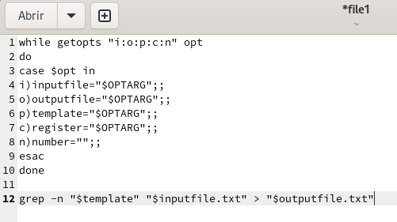
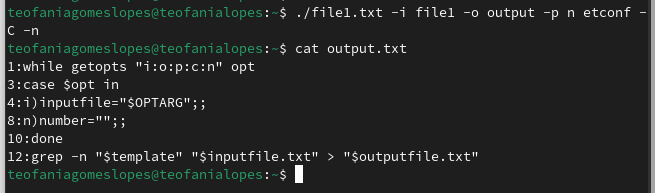
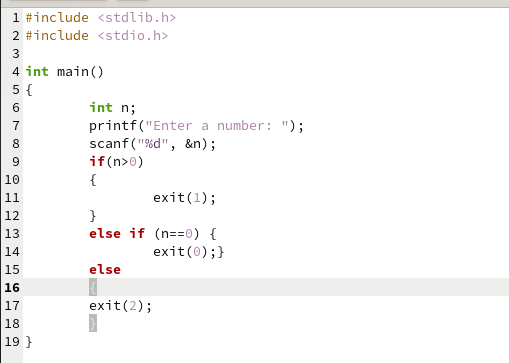
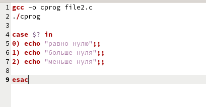
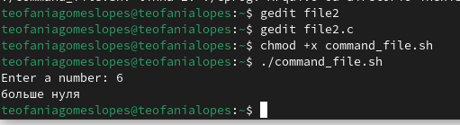
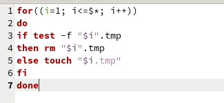
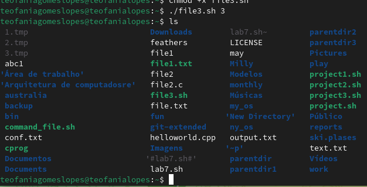
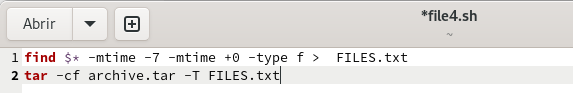
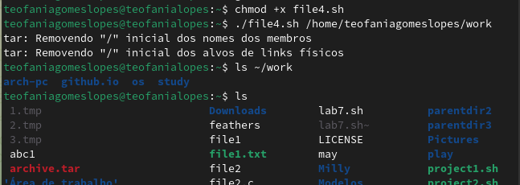

---
## Front matter
lang: ru-RU
title: Структура научной презентации по лабораторной работе 13
subtitle: Операционные системы
author:
  - Гомес Лопес Теофания
institute:
  - Российский университет дружбы народов, Москва, Россия
date: 05 мая 2025

## i18n babel
babel-lang: russian
babel-otherlangs: english

## Formatting pdf
toc: false
toc-title: Содержание
slide_level: 2
aspectratio: 169
section-titles: true
theme: metropolis
header-includes:
 - \metroset{progressbar=frametitle,sectionpage=progressbar,numbering=fraction}
---

# Цель работы

Изучить основы программирования в оболочке ОС UNIX. Научится писать более сложные командные файлы с использованием логических управляющих конструкций и циклов.

# Задание

1. Используя команды getopts grep, написать командный файл, который анализирует командную строку 
2. Написать на языке Си программу, которая вводит число и определяет, является ли оно больше нуля, меньше нуля или равно нулю.
3. Написать командный файл, создающий указанное число файлов, пронумерованных последовательно от 1 до N
4. Написать командный файл, который с помощью команды tar запаковывает в архив все файлы в указанной директории.

# Выполнение лабораторной работы

## командный файл, который анализирует командную строку 

Создаю файл file1 и в нем написала код, который анализирует командную строку с ключами -i (прочитать данные из указанного файла), -o (вывести данные в указанный файл), -p (указать шаблон для поиска), -C (различать большие и малые буквы), -n (выдавать номера строк) используя команды getopts grep:

## командный файл, который анализирует командную строку 

{#fig:001 width=70%}

## командный файл, который анализирует командную строку 

{#fig:003 width=70%}

## программa, которая вводит число и определяет, является ли оно больше нуля, меньше нуля или равно нулю.

Написала на языке Си программу, которая вводит число и определяет, является ли оно больше нуля, меньше нуля или равно нулю. 

{#fig:004 width=70%}

## программa, которая вводит число и определяет, является ли оно больше нуля, меньше нуля или равно нулю.

Далее создала командный файл который вызывает эту программу и, проанализировав с помощью команды $?, выдает сообщение о том, какое число было введено:

{#fig:005 width=70%}

## программa, которая вводит число и определяет, является ли оно больше нуля, меньше нуля или равно нулю.

Создала исполняемый файл и запустила:

{#fig:006 width=70%}

## командный файл, создающий указанное число файлов

Я написала командный файл, создающий указанное число файлов, пронумерованных последовательно от 1 до 𝑁. 

{#fig:007 width=70%}

## командный файл, создающий указанное число файлов

Создала исполняемый файл и запустила:

{#fig:008 width=70%}

## командный файл, который с помощью команды tar запаковывает в архив все файлы в указанной директории.

создала командный файл, который с помощью команды tar запаковывает в архив все файлы в указанной директории. 

{#fig:009 width=70%}

## командный файл, который с помощью команды tar запаковывает в архив все файлы в указанной директории.

{#fig:0010 width=70%}

# Выводы

При выполнении проделанной работы я научилась писать более сложные командные файлы с использованием логических управляющих конструкций и циклов.
