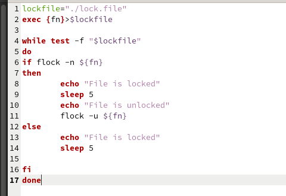
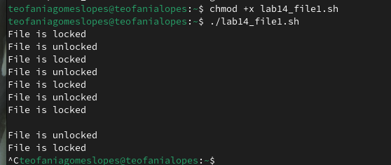
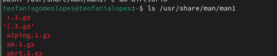
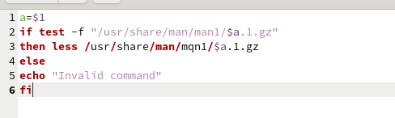
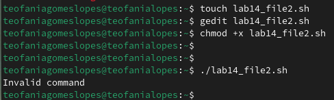
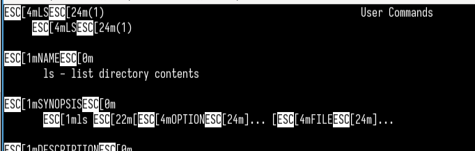
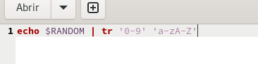
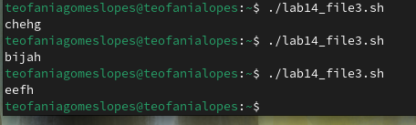

---
## Front matter
lang: ru-RU
title: Структура презентации по лабораторной работе 14
subtitle: Операционные системы
author:
  - Гомес Лопес Теофания
institute:
date: 12 мая 2025

## i18n babel
babel-lang: russian
babel-otherlangs: english

## Formatting pdf
toc: false
toc-title: Содержание
slide_level: 2
aspectratio: 169
section-titles: true
theme: metropolis
header-includes:
 - \metroset{progressbar=frametitle,sectionpage=progressbar,numbering=fraction}
---

# Цель работы

Изучить основы программирования в оболочке ОС UNIX. Научиться писать более сложные командные файлы с использованием логических управляющих конструкций и циклов.

# Задание

1. Написать командный файл, реализующий упрощённый механизм семафоров.
2. Реализовать команду man с помощью командного файла.
3. Используя встроенную переменную $RANDOM, написать командный файл, генерирующий случайную последовательность букв латинского алфавита.

# Выполнение лабораторной работы

Чтобы создать данный командный файл, я создала новый файл и написала в нем некоторый скрипт. Он устанавливает переменную lockfile для пути к файлу блокировки, открывает файл для записи и назначает ему дескриптор файла. 

{#fig:001 width=70%}

# Выполнение лабораторной работы

{#fig:002 width=70%}

## Реализовать команду man с помощью командного файла

Я изучила содержимое каталога /usr/share/man/man1. В нем находятся архивы текстовых файлов, содержащих справку по большинству установленных в системе программ и команд:

{#fig:003 width=70%}

## Реализовать команду man с помощью командного файла

Потом я создала файл и в нем написала скрипт реализирующий команды man. 

{#fig:004 width=70%}

## Реализовать команду man с помощью командного файла

{#fig:005 width=70%}

## Реализовать команду man с помощью командного файла

{#fig:006 width=70%}

## написать командный файл, генерирующий случайную последовательность букв латинского алфавита.

Я написала скрипт который генерирует случайное число используя $RANDOM, а затем с помощью tr заменяет каждую цифру на букву от 'a-z' и 'A-Z': 

{#fig:007 width=70%}

## написать командный файл, генерирующий случайную последовательность букв латинского алфавита.

{#fig:008 width=70%}

# Выводы

При выполнении данной работы я научилась писать более сложные командные файлы с использованием логических управляющих конструкций и циклов.

