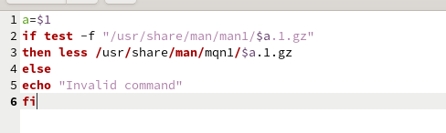
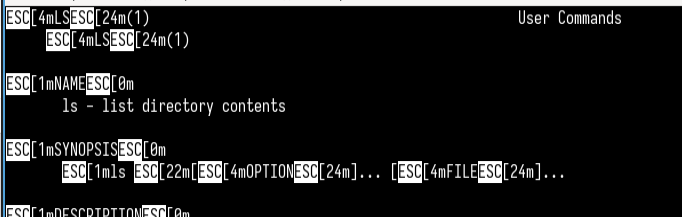
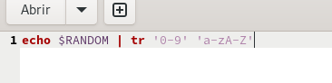

---
## Front matter
title: "Отчёт по лабораторной работе 14"
subtitle: "Операционные системы"
author: "Гомес Лопес Теофания"

## Generic otions
lang: ru-RU
toc-title: "Содержание"

## Bibliography
bibliography: bib/cite.bib
csl: pandoc/csl/gost-r-7-0-5-2008-numeric.csl

## Pdf output format
toc: true # Table of contents
toc-depth: 2
lof: true # List of figures
lot: true # List of tables
fontsize: 12pt
linestretch: 1.5
papersize: a4
documentclass: scrreprt
## I18n polyglossia
polyglossia-lang:
  name: russian
  options:
	- spelling=modern
	- babelshorthands=true
polyglossia-otherlangs:
  name: english
## I18n babel
babel-lang: russian
babel-otherlangs: english
## Fonts
mainfont: IBM Plex Serif
romanfont: IBM Plex Serif
sansfont: IBM Plex Sans
monofont: IBM Plex Mono
mathfont: STIX Two Math
mainfontoptions: Ligatures=Common,Ligatures=TeX,Scale=0.94
romanfontoptions: Ligatures=Common,Ligatures=TeX,Scale=0.94
sansfontoptions: Ligatures=Common,Ligatures=TeX,Scale=MatchLowercase,Scale=0.94
monofontoptions: Scale=MatchLowercase,Scale=0.94,FakeStretch=0.9
mathfontoptions:
## Biblatex
biblatex: true
biblio-style: "gost-numeric"
biblatexoptions:
  - parentracker=true
  - backend=biber
  - hyperref=auto
  - language=auto
  - autolang=other*
  - citestyle=gost-numeric
## Pandoc-crossref LaTeX customization
figureTitle: "Рис."
tableTitle: "Таблица"
listingTitle: "Листинг"
lofTitle: "Список иллюстраций"
lotTitle: "Список таблиц"
lolTitle: "Листинги"
## Misc options
indent: true
header-includes:
  - \usepackage{indentfirst}
  - \usepackage{float} # keep figures where there are in the text
  - \floatplacement{figure}{H} # keep figures where there are in the text
---

# Цель работы

Изучить основы программирования в оболочке ОС UNIX. Научиться писать более сложные командные файлы с использованием логических управляющих конструкций и циклов.

# Задание

1. Написать командный файл, реализующий упрощённый механизм семафоров.
2. Реализовать команду man с помощью командного файла.
3. Используя встроенную переменную $RANDOM, написать командный файл, генерирующий случайную последовательность букв латинского алфавита.

# Выполнение лабораторной работы

Чтобы создать данный командный файл, я создала новый файл и написала в нем некоторый скрипт. Он устанавливает переменную lockfile для пути к файлу блокировки, открывает файл для записи и назначает ему дескриптор файла. Далее входит в цикл, который выполняется, пока файл блокировки существует. Пытается получить эксклусивную блокировку для файла. Если это удается, выводит "file locked", ждет 5 секунд а затем выводит "file unlocked": 

{#fig:001 width=70%}

{#fig:002 width=70%}

## Реализовать команду man с помощью командного файла

Я изучила содержимое каталога /usr/share/man/man1. В нем находятся архивы текстовых файлов, содержащих справку по большинству установленных в системе программ и команд:

{#fig:003 width=70%}

Потом я создала файл и в нем написала скрипт реализирующий команды man. Он принимает аргумент $1, проверяет существование файла в /usr/share/man/man1, и если файл существует, использует less для отображения содержимого сжатой страницы руководства. Если файл не существует, выводит "invalid command":

{#fig:004 width=70%}

{#fig:005 width=70%}

{#fig:006 width=70%}

## написать командный файл, генерирующий случайную последовательность букв латинского алфавита.

Я написала скрипт который генерирует случайное число используя $RANDOM, а затем с помощью tr заменяет каждую цифру на букву от 'a-z' и 'A-Z': 

{#fig:007 width=70%}

{#fig:008 width=70%}

# Выводы

При выполнении данной работы я научилась писать более сложные командные файлы с использованием логических управляющих конструкций и циклов.

# Ответы на контрольные вопросы

1. В данной строчке допущены следующие ошибки: не хватает пробелов после первой скобки [ и перед второй скобкой ] выражение $1 необходимо взять в “”, потому что эта переменная может содержать пробелы Таким образом, правильный вариант должен выглядеть так: while [ “$1” != "exit" ]

2. Чтобы объединить несколько строк в одну, можно воспользоваться несколькими способами: Первый: VAR1="Hello," VAR2=" World" VAR3="$VAR1$VAR2" echo "$VAR3" Результат: Hello, World Второй: VAR1="Hello, " VAR1+=" World" echo "$VAR1" Результат: Hello, World

3. Команда seq в Linux используется для генерации чисел от ПЕРВОГО до ПОСЛЕДНЕГО шага INCREMENT. Параметры: seq LAST: если задан только один аргумент, он создает числа от 1 до LAST с шагом шага, равным 1. Если LAST меньше 1, значение is не выдает. seq FIRST LAST: когда заданы два аргумента, он генерирует числа от FIRST до LAST с шагом 1, равным 1. Если LAST меньше FIRST, он не выдает никаких выходных данных. seq FIRST INCREMENT LAST: когда заданы три аргумента, он генерирует числа от FIRST до LAST на шаге INCREMENT. Если LAST меньше, чем FIRST, он не производит вывод. seq -f «FORMAT» FIRST INCREMENT LAST: эта команда используется для генерации последовательности в форматированном виде. FIRST и INCREMENT являются необязательными. seq -s «STRING» ПЕРВЫЙ ВКЛЮЧЕНО: Эта команда используется для STRING для разделения чисел. По умолчанию это значение равно /n. FIRST и INCREMENT являются необязательными. seq -w FIRST INCREMENT LAST: эта команда используется для выравнивания ширины путем заполнения начальными нулями. FIRST и INCREMENT являются необязательными.

4. Результатом данного выражения $((10/3)) будет 3, потому что это целочисленное деление без остатка.

5. Отличия командной оболочки zsh от bash: В zsh более быстрое автодополнение для cd с помощью Тab В zsh существует калькулятор zcalc, способный выполнять вычисления внутри терминала В zsh поддерживаются числа с плавающей запятой В zsh поддерживаются структуры данных «хэш» В zsh поддерживается раскрытие полного пути на основенеполных данных В zsh поддерживается замена части пути В zsh есть возможность отображать разделенный экран, такой же как разделенный экран vim

6. for ((a=1; a <= LIMIT; a++)) синтаксис данной конструкции верен, потому что, используя двойные круглые скобки, можно не писать $ перед переменными ().

7. Преимущества и недостатки скриптового языка bash:

Один из самых распространенных и ставится по умолчанию в большинстве дистрибутивах Linux, MacOS
Удобное перенаправление ввода/вывода
Большое количество команд для работы с файловыми системами Linux
Можно писать собственные скрипты, упрощающие работу в Linux Недостатки скриптового языка bash:
Дополнительные библиотеки других языков позволяют выполнить больше действий
Bash не является языков общего назначения
Утилиты, при выполнении скрипта, запускают свои процессы, которые, в свою очередь, отражаются на быстроте выполнения этого скрипта
Скрипты, написанные на bash, нельзя запустить на других операционных системах без дополнительных действий

# Список литературы{.unnumbered}

::: {#refs}
:::
