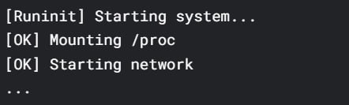
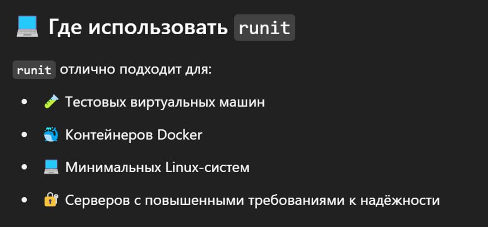
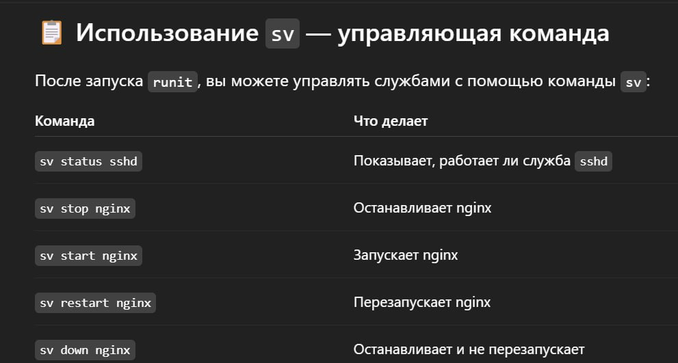
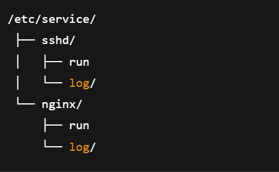

---
## Front matter
lang: ru-RU
title: Доклад
subtitle: Система инициализации Runinit
author:
  - Гомес Лопес Теофания
institute:
  - Российский университет дружбы народов, Москва, Россия
date: 02 мая 2025

## i18n babel
babel-lang: russian
babel-otherlangs: english

## Formatting pdf
toc: false
toc-title: Содержание
slide_level: 2
aspectratio: 169
section-titles: true
theme: metropolis
header-includes:
 - \metroset{progressbar=frametitle,sectionpage=progressbar,numbering=fraction}
---

# Информация

# Цель работы

узнать больше о Системе инициализации Runinit

# Выполнение работы

Что такое система инициализации?

Система инициализации — это программа, которая запускается первой при включении компьютера с Linux. Она подготавливает систему к работе: запускает службы (например, сеть, графику, звук).

{#fig:001 width=70%}

1. Что такое Runinit

## Что такое Runinit

Runinit — это простая и быстрая система инициализации, которая управляет процессами в ОС. Она используется в некоторых дистрибутивах Linux вместо более сложных систем, таких как systemd или SysVinit.

{#fig:002 width=70%}

2. Runinit

## Runinit

Она состоит из трёх частей:
init – запускается первым.
runsvdir – управляет службами.
runsv – запускает и перезапускает каждую службу.

3. Как работает Runinit?

## Как работает Runinit?

Структура Runinit
Runinit использует простые конфигурационные файлы. Основные компоненты:
/etc/runinit/ — директория с конфигурацией сервисов
/run/runinit/ — временные файлы процессов

{#fig:003 width=70%}

## Где использовать Runinit

{#fig:003 width=70%}

## Где использовать Runinit

{#fig:003 width=70%}

{#fig:003 width=70%}

4. Преимущества Runinit

## Преимущества Runinit:

Простота: легко настраивается.
Скорость: запускается очень быстро.
Надёжность: службы автоматически перезапускаются, если падают.
Маленький размер: подходит для встраиваемых систем (например, роутеров).

5. Недостатки Runinit

## Недостатки Runinit

Меньше функций — нет сложных возможностей, как в systemd
Ручная настройка — нужно самому прописывать сервисы

## Как работает запуск:

Система запускает init.
init запускает runsvdir, который следит за /etc/service.
Для каждой службы runsvdir запускает runsv, который запускает скрипт run

{#fig:004 width=70%}

Каждая служба — это папка с файлом run, который запускает программу. Это просто и удобно.

# Заключение

Runinit — это лёгкая и быстрая альтернатива большим системам, таким как systemd. Подходит для тех, кто ценит контроль, простоту и надёжность.
