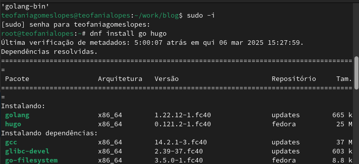
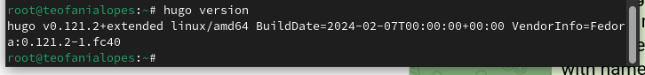
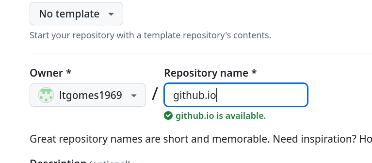
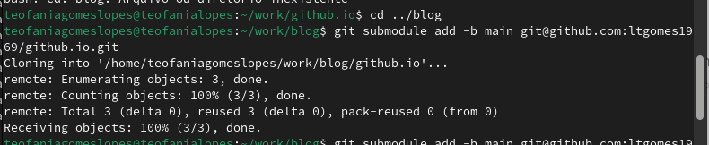
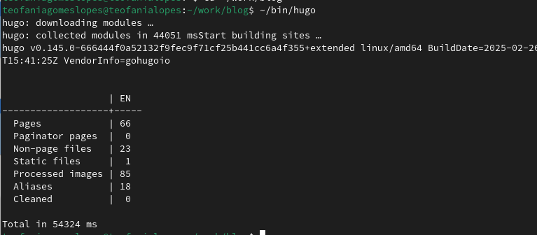
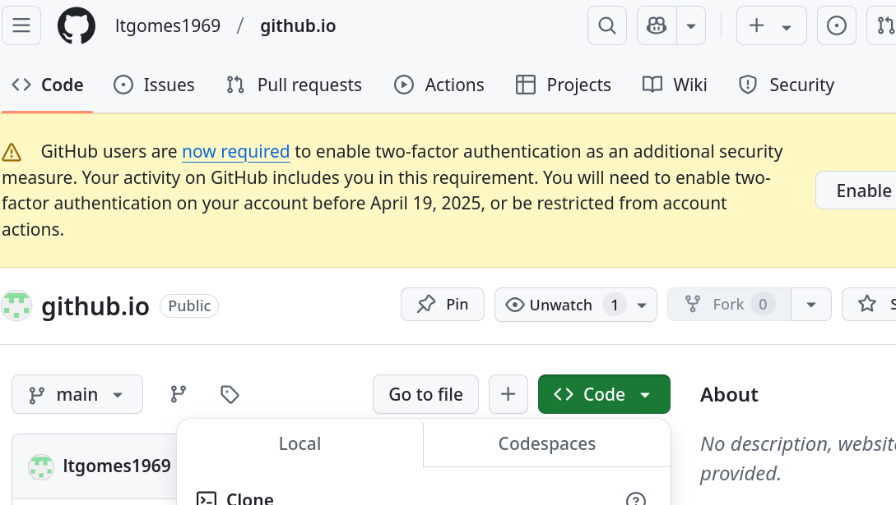
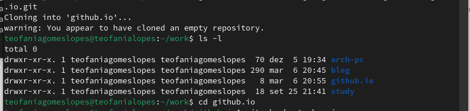
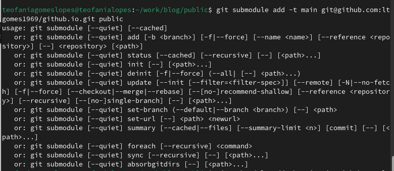
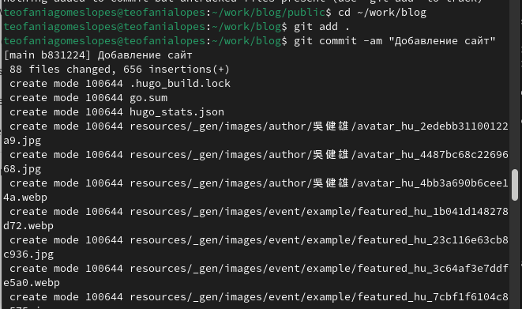

---
## Front matter
lang: ru-RU
title: Индивидуальный проект. Первый этап
subtitle: Простейший шаблон
author:
  - Гомес Лопес Теофания

## Formatting pdf
toc: false
toc-title: Содержание
slide_level: 2
aspectratio: 169
section-titles: true
theme: metropolis
header-includes:
 - \metroset{progressbar=frametitle,sectionpage=progressbar,numbering=fraction}
---

## Цель работы

Создать сайт на Hugo.

## Задание

1. Установить необходимое программное обеспечение.
2. Скачать шаблон темы сайта.
3. Разместить его на хостинге git.
4. Установить параметр для URLs сайта.
5. Разместить заготовку сайта на Github pages.

## Выполнение лабораторной работы

1. Установим необходимое програмное обеспечение. Скачаем Hugo и Go. Скачаем необходимый релиз и положим его в папку /tmp/01. Распакованный файл hugo поместим в usr/local/bin.

{ #fig:001 width=70% }

Проверим версию Hugo.

{ #fig:002 width=70% }

## Выполнение лабораторной работы

2. В качестве шаблона индивидуального сайта используется шаблон Hugo Academic Theme. Переходим по ссылке и создаем репозиторий blog 

{ #fig:003 width=70% }

Клонируем репозиторий.

{ #fig:004 width=70% }

## Выполнение лабораторной работы

3. Выполним команду hugo server (создадутся необходимые файлы). Нам предоставят ссылку. Переходя по ней, открывается наш сайт (пока на него можно заходить только с моего компьютера).

{ #fig:005 width=70% }

## Выполнение лабораторной работы

4. Необходимо создать еще один репозиторий, чтобы наш сайт можно было открывать с любого компьютера.

{ #fig:006 width=70% }

Клонируем наш новый репозиторий. Создаем ветку main. Создаем файл README.md. Добавляем в наш репозиторий. 

{ #fig:007 width=70% }

## Выполнение лабораторной работы

5. Подключаем наш репозиторий к папке public. 

{ #fig:008 width=70% }

Добавление файлов в репозиторий. 

{ #fig:009 width=70% }

# Выводы

Научились создавать статические сайты с помощью Hugo

