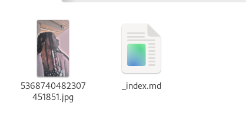
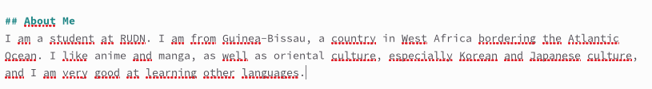
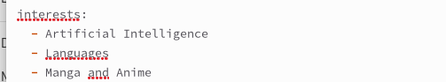
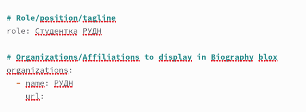
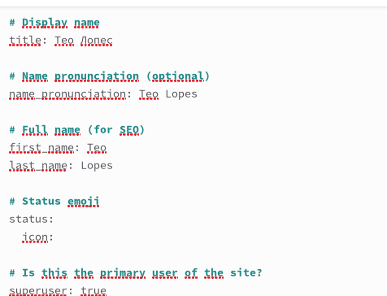
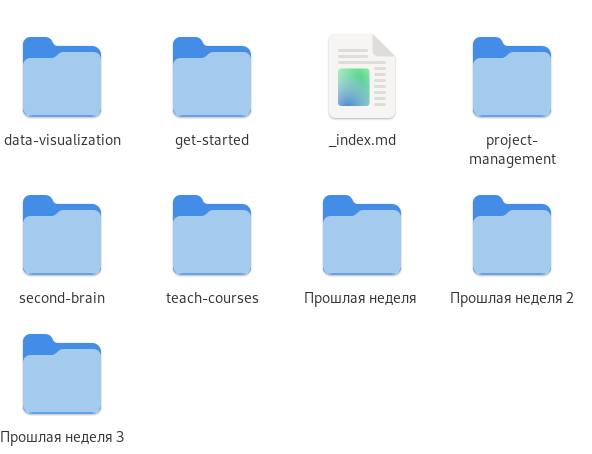
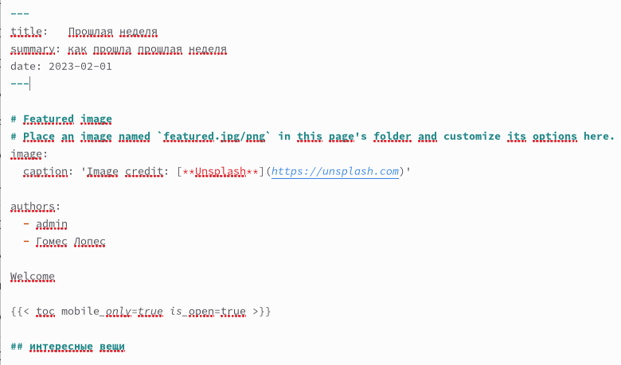
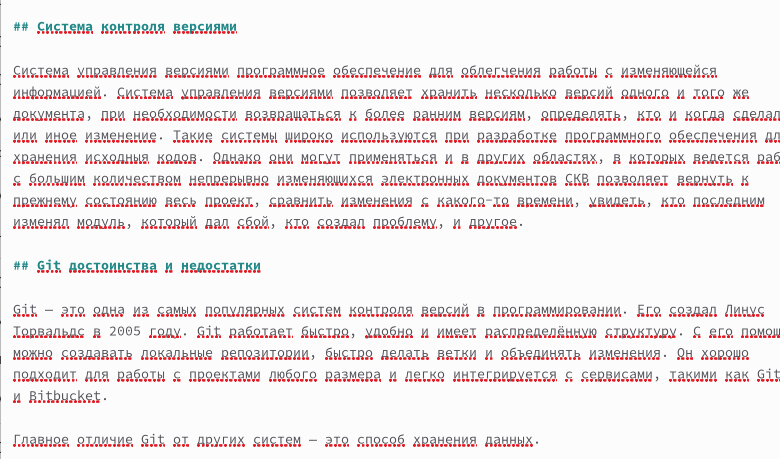
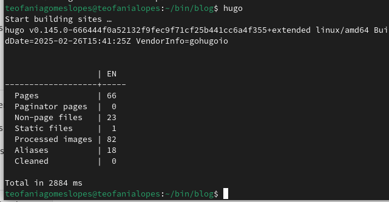
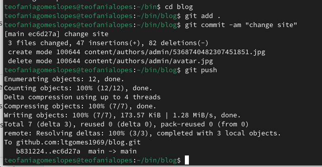

---
## Front matter
lang: ru-RU
title: Индивидуальный проект. Второй этап
subtitle: Операционные системы
author:
  - Гомес Лопес Теофания
institute:
  - Российский университет дружбы народов, Москва, Россия
date: 18 марта 2025

## i18n babel
babel-lang: russian
babel-otherlangs: english

## Formatting pdf
toc: false
toc-title: Содержание
slide_level: 2
aspectratio: 169
section-titles: true
theme: metropolis
header-includes:
 - \metroset{progressbar=frametitle,sectionpage=progressbar,numbering=fraction}
---

## Цель работы

Продолжить работы со своим сайтом. Редактировать его в соответствии с требованиями. Добавить данные о себе.

# Задание

1. Разместить фотографию владельца сайта.
2. Разместить краткое описание владельца сайта (Biography).
3. Добавить информацию об интересах (Interests).
4. Добавить информацию от образовании (Education).
5. Сделать пост по прошедшей неделе.
6. Добавить пост на тему управление версиями. Git.

# Выполнение лабораторной работы

Добавила свою фотографию в папку blog/content/authors/admin, удалила фотографию шаблона 

{#fig:001 width=70%}

## Библиография

В файлу index.md в той же папке изменяю поля. Начинаю с библиографии

{#fig:002 width=70%}

## Интересы

Изменила интересы на свои

{#fig:003 width=70%}

##  Образование

Добавила свое образование

{#fig:004 width=70%}

Обновила личные данные, чтобы они были про меня 

{#fig:005 width=70%}

## Создание папки

Создаю папки в директории post, которые обозначают посты и в которых будут тексты постов, картинки и доп. файлы

{#fig:006 width=70%}

## Заполнение файл index.md

Заполнила файл index.md в post1, это пост про прошедшую неделю 

{#fig:007 width=70%}

Заполнила файл index.md в post2, это пост про управление версиями Git 

{#fig:008 width=70%}

Закрываю локальный сервер. Генерирую сайт с изменениями 

{#fig:009 width=70%}

## Сохранение на гите

Сохраняю изменения на гите

{#fig:010 width=70%}

# Выводы

В процессе выполнения второго этапа индивидуального проекта я научилась редактировать данные о себе, а также писать посты и добавлять их на сайт.

:::

