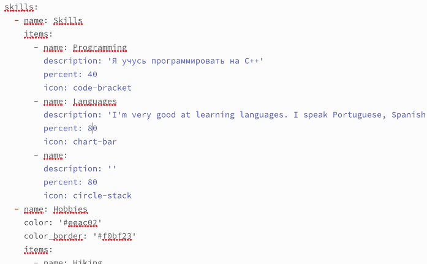
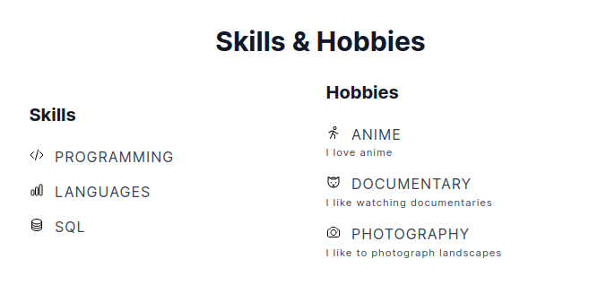
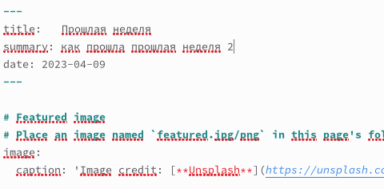
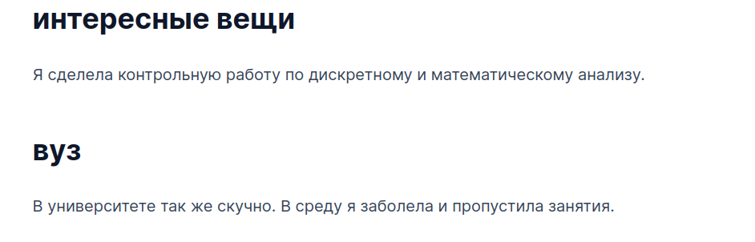
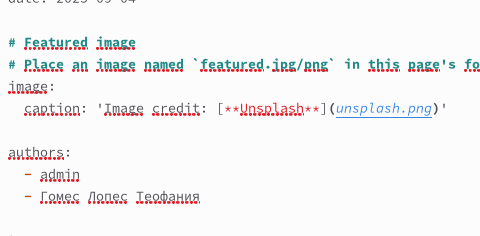

---
## Front matter
lang: ru-RU
title: Отчет по индивидуальному проекту этап 3
subtitle: Операционные системы
author:
  - Гомес Лопес Теофания
institute:
  - Российский университет дружбы народов, Москва, Россия
date: 09 апреля января 2025

## i18n babel
babel-lang: russian
babel-otherlangs: english

## Formatting pdf
toc: false
toc-title: Содержание
slide_level: 2
aspectratio: 169
section-titles: true
theme: metropolis
header-includes:
 - \metroset{progressbar=frametitle,sectionpage=progressbar,numbering=fraction}
---

# Выполнение лабораторной работы

Добавляем в файл необходимую информацию о навыках, достижениях и опыте.

{#fig:001 width=70%}

# Выполнение лабораторной работы

Выгружаем информацию на сайт.

{#fig:002 width=70%}

# Выполнение лабораторной работы

Создаем пост о прошлой неделе. 

{#fig:003 width=70%}

# Выполнение лабораторной работы

Выкладываем пост на сайт. 

{#fig:004 width=70%}

# Выполнение лабораторной работы

Создаём пост на выбранную тему. 

{#fig:005 width=70%}

{#fig:006 width=70%}
