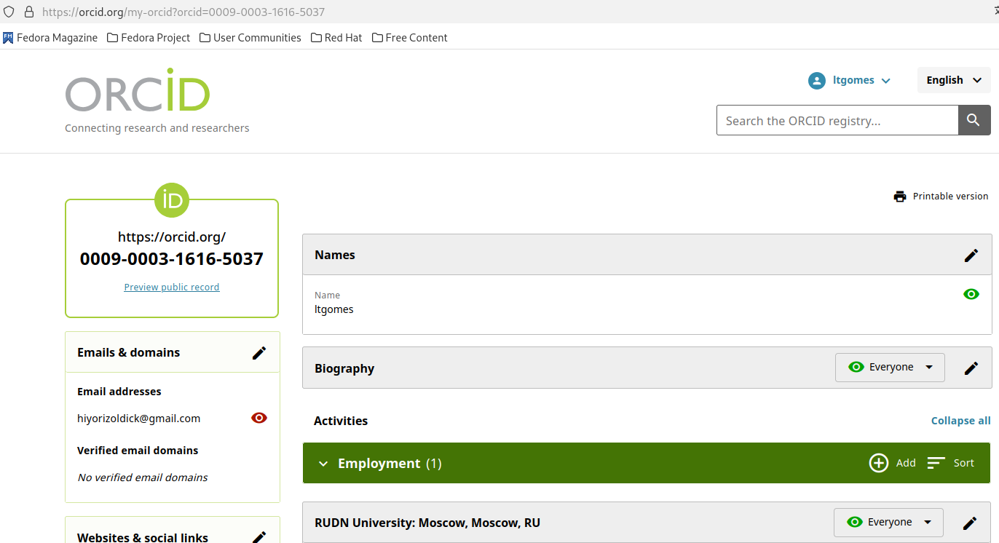
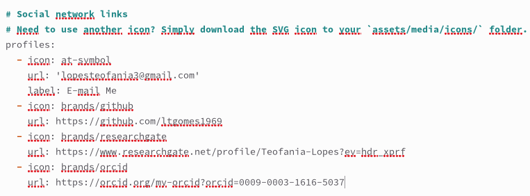
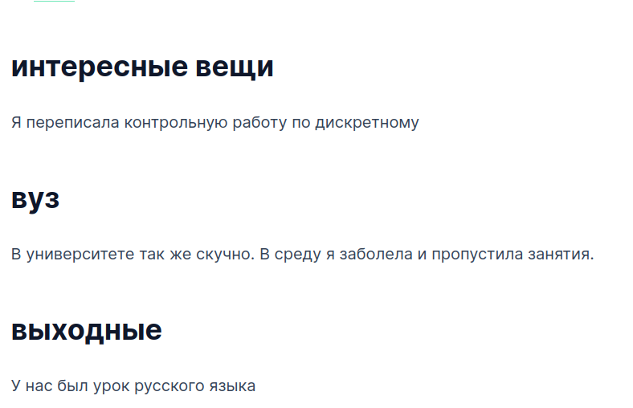
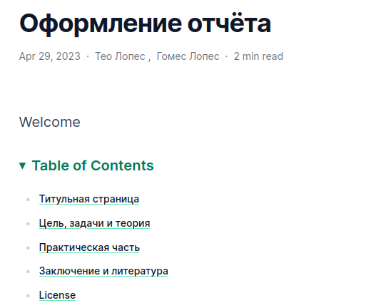

---
## Front matter
lang: ru-RU
title: Отчет по индивидуальному проекту этап 4
subtitle: Операционные системы
author:
  - Гомес Лопес Теофания
institute:
  - Российский университет дружбы народов, Москва, Россия
date: 29 апреля 2025

## i18n babel
babel-lang: russian
babel-otherlangs: english

## Formatting pdf
toc: false
toc-title: Содержание
slide_level: 2
aspectratio: 169
section-titles: true
theme: metropolis
header-includes:
 - \metroset{progressbar=frametitle,sectionpage=progressbar,numbering=fraction}
---

# Цель работы

Добавить к сайту ссылки на научные и библиометрические ресурсы.

# Задание

1. Зарегистрироваться на соответствующих ресурсах и разместить на них ссылки на сайте
2. Сделать пост по прошедшей неделе.
3. Добавить пост на тему: Оформление отчёта.

# Выполнение лабораторной работы

Зарегистрировалась на требуемых ресурсах.

{#fig:001 width=70%}

# Выполнение лабораторной работы

Внесла ссылки в файл с информацией о себе.

{#fig:002 width=70%}

# Выполнение лабораторной работы

Написала пост о предыдущей неделе и опубликовала его на сайте.

{#fig:003 width=70%}

# Выполнение лабораторной работы

Создала пост на выбранную тему и опубликовала его на сайте.

{#fig:004 width=70%}

# Выводы

Добавила на сайт ссылки на научные и библиометрические ресурсы.

