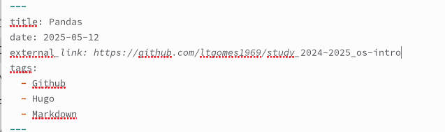
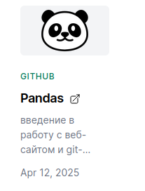
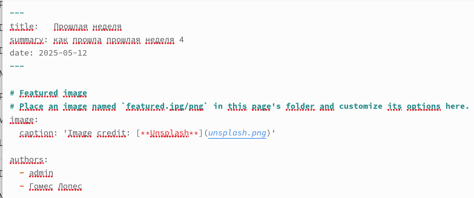
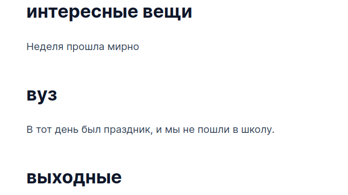
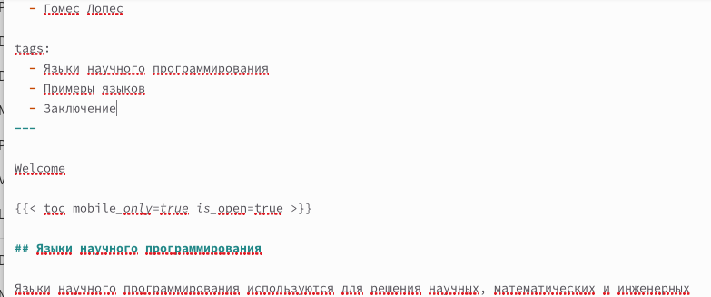
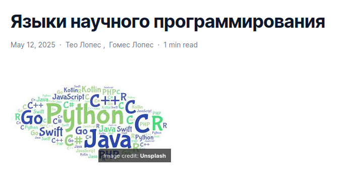

---
## Front matter
lang: ru-RU
title: Структура презентации по индивидуальному проекту этап 5"
subtitle: Операционные системы
author:
  - Гомес Лопес Теофания
institute:
  - Российский университет дружбы народов, Москва, Россия
date: 12 мая 2025

## i18n babel
babel-lang: russian
babel-otherlangs: english

## Formatting pdf
toc: false
toc-title: Содержание
slide_level: 2
aspectratio: 169
section-titles: true
theme: metropolis
header-includes:
 - \metroset{progressbar=frametitle,sectionpage=progressbar,numbering=fraction}
---

# Задание

1. Сделайте записи для профессиональных проектов.

2. Сделайте пост по прошедшей неделе.

3. Добавить пост на тему по выбору.

# Выполнение лабораторной работы

Оформеляеи файл  с записями рофессиональных проектов.

{#fig:001 width=70%}

# Выполнение лабораторной работы

Мы вносим изменения на сервер

{#fig:002 width=70%}

# Выполнение лабораторной работы

Давайте напишем пост о прошлой неделе.

{#fig:003 width=70%}

# Выполнение лабораторной работы

Выкладываем на сайт. 

{#fig:004 width=70%}

# Выполнение лабораторной работы

Делаем пост на тему 

{#fig:005 width=70%}

# Выполнение лабораторной работы

Выкладываем на сайт. 

{#fig:006 width=70%}

# Выводы

Добавлены необходимые изменения на сайт,

