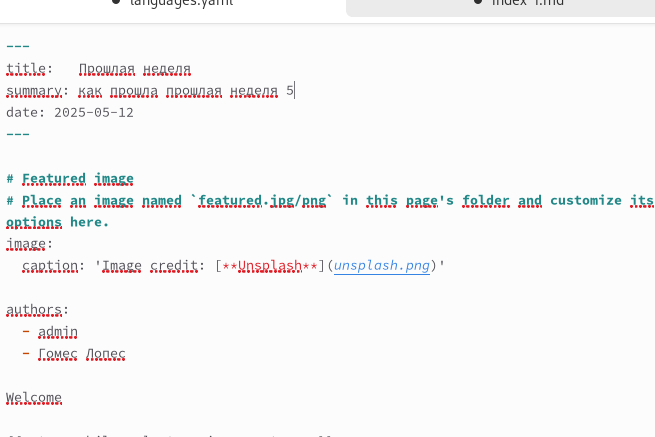
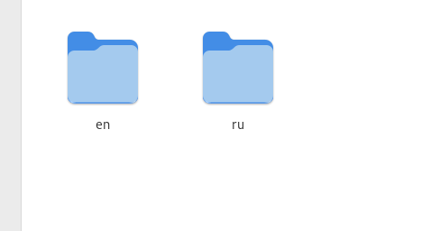
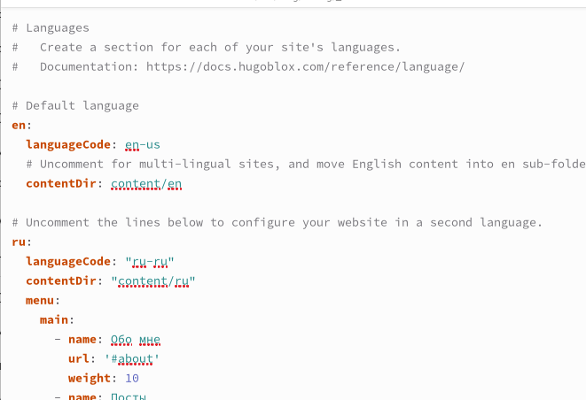

---
## Front matter
lang: ru-RU
title: Структура по индивидуальному проекту этап 6
subtitle: Операционные системы
author:
  - Гомес Лопес Теофания
institute:
  - Российский университет дружбы народов, Москва, Россия
date: 

## i18n babel
babel-lang: russian
babel-otherlangs: english

## Formatting pdf
toc: false
toc-title: Содержание
slide_level: 2
aspectratio: 169
section-titles: true
theme: metropolis
header-includes:
 - \metroset{progressbar=frametitle,sectionpage=progressbar,numbering=fraction}
---

# Цель работы

Сделать поддержку русского и английского языков 

# Задание

Размещение двуязычного сайта на Github.

- Сделать поддержку английского и русского языков.
- Сделать пост по прошедшей неделе.

# Выполнение лабораторной работы

Добавим русский язык в файл имеющий путь ~/work/blog/config/_default/languages.yaml. (рис. [-@fig:001])

{ #fig:001 width=70% }

# Выполнение лабораторной работы

Теперь в директории content создадим две директории ru и en. Переведём все статьи и прочие разделы на английский язык (рис. [-@fig:002])

{ #fig:002 width=70% }

# Выполнение лабораторной работы

Давайте напишем пост о прошлой неделе.

{ #fig:004 width=70% }

