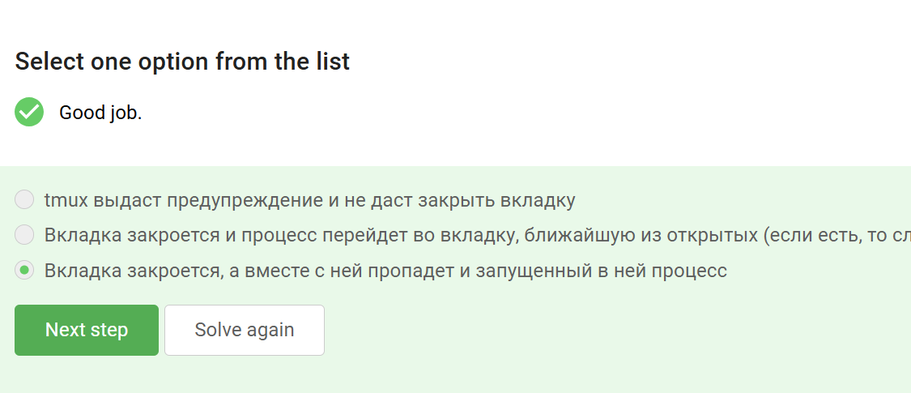

---
## Front matter
title: "2 этапа внешних курсов"
subtitle: "Работа на сервере"
author: "Гомес Лопес Теофания"

## Generic otions
lang: ru-RU
toc-title: "Содержание"

## Bibliography
bibliography: bib/cite.bib
csl: pandoc/csl/gost-r-7-0-5-2008-numeric.csl

## Pdf output format
toc: true # Table of contents
toc-depth: 2
lof: true # List of figures
lot: true # List of tables
fontsize: 12pt
linestretch: 1.5
papersize: a4
documentclass: scrreprt
## I18n polyglossia
polyglossia-lang:
  name: russian
  options:
	- spelling=modern
	- babelshorthands=true
polyglossia-otherlangs:
  name: english
## I18n babel
babel-lang: russian
babel-otherlangs: english
## Fonts
mainfont: PT Serif
romanfont: PT Serif
sansfont: PT Sans
monofont: PT Mono
mainfontoptions: Ligatures=TeX
romanfontoptions: Ligatures=TeX
sansfontoptions: Ligatures=TeX,Scale=MatchLowercase
monofontoptions: Scale=MatchLowercase,Scale=0.9
## Biblatex
biblatex: true
biblio-style: "gost-numeric"
biblatexoptions:
  - parentracker=true
  - backend=biber
  - hyperref=auto
  - language=auto
  - autolang=other*
  - citestyle=gost-numeric
## Pandoc-crossref LaTeX customization
figureTitle: "Рис."
tableTitle: "Таблица"
listingTitle: "Листинг"
lofTitle: "Список иллюстраций"
lotTitle: "Список таблиц"
lolTitle: "Листинги"
## Misc options
indent: true
header-includes:
  - \usepackage{indentfirst}
  - \usepackage{float} # keep figures where there are in the text
  - \floatplacement{figure}{H} # keep figures where there are in the text
---

# Цель работы

Ознакомиться с функционалом операционной системы Linux.

# Задание

Просмотреть видео и на основе полученной информации пройти тестовые задания.

# Выполнение лабораторной работы

2 Этап: 

{#fig:001 width=70%}

Удаленный сервер - это компьютер, находящийся в дата-центре, к которому можно получить удаленный доступ через сеть Интернет. 

{#fig:002 width=70%}

Только id_rsa.pub, так как он является открытым.

{#fig:003 width=70%}

-r = Recursively copy entire directories. Note that scp follows symbolic links encountered in the tree traversal.

{#fig:004 width=70%}

Проверяем интернет соединение на предмет того, что устройство не может соединиться с сервером, затем проверяем то, знает ли оно вообще о существовании такой программы.

{#fig:005 width=70%}

FileZilla — свободный многоязычный проект, посвящённый приложениям для FTP. 

{#fig:006 width=70%}

{#fig:007 width=70%}

{#fig:008 width=70%}

{#fig:009 width=70%}

-align
Do full multiple alignment.

{#fig:010 width=70%}

Комбинация Ctrl+С - завершает процесс.
Комбинация Ctrl+Z - приостанавливает процесс.

{#fig:011 width=70%}

{#fig:012 width=70%}

Если сигнал не перехватывается процессом, процесс уничтожается. Следовательно, это используется для изящного завершения процесса. Команда «kill -9» отправляет сигнал уничтожения для немедленного завершения любого процесса, если он присоединен к PID или имени процесса . Это принудительный способ убить/завершить набор процессов

{#fig:013 width=70%}

Запущенная программа потребляет ресурсы CPU, а остановленная нет.

{#fig:015 width=70%}

Приостановленное приложение не выполняет новых действий, поэтому не занимает вычислительные ресурсы компьютера (CPU 0%). 

{#fig:016 width=70%}

{#fig:017 width=70%}

{#fig:018 width=70%}

```
echo "306174 reads; of these:
  306174 (100.00%) were unpaired; of these:
    11 (0.00%) aligned 0 times
    305580 (99.81%) aligned exactly 1 time
    583 (0.19%) aligned >1 times
100.00% overall alignment rate" > bowtie.log

```

{#fig:019 width=70%}

{#fig:020 width=70%}

exit завершает работу tmux

{#fig:021 width=70%}

Мы заходили на сервер с терминала, который и закрыли, а tmux будет продолжать свою работу на сервере.

{#fig:022 width=70%}

Ещё будет предупреждение о том, что работа завершится. Запущенный процесс во вкладке, конечно же, при её закрытии, пропадёт.

{#fig:023 width=70%}

Ctrl+b c - создать новое окно;

{#fig:024 width=70%}

Можно закрыть одно из делений вкладки выполнив команды Ctrl+B и Х.

# Выводы

Я просмотрела курс и освежила в памяти навыки работы с более сложными командами в Линукс.

# Список литературы{.unnumbered}


::: {#refs}
:::
