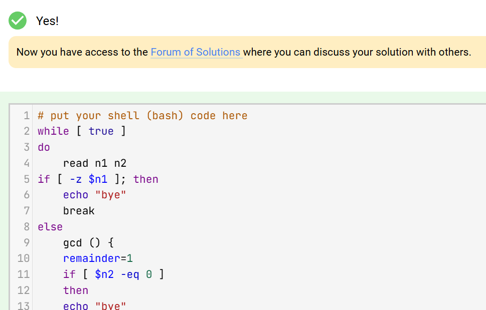
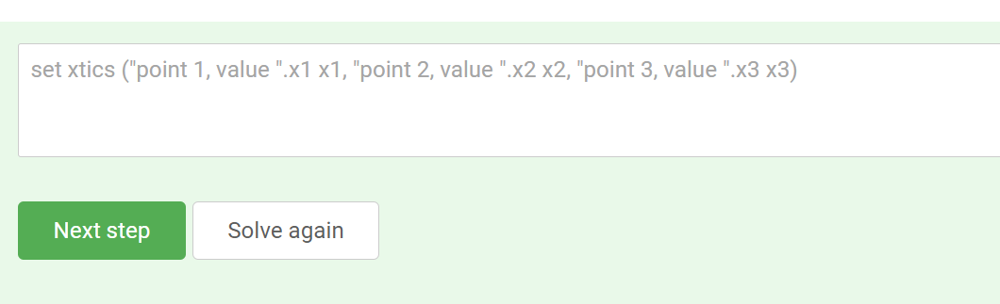
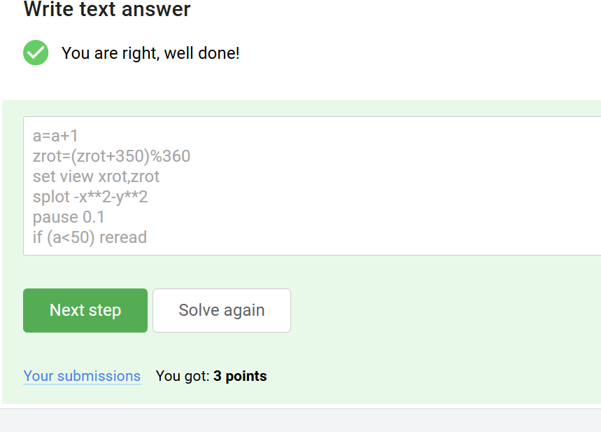
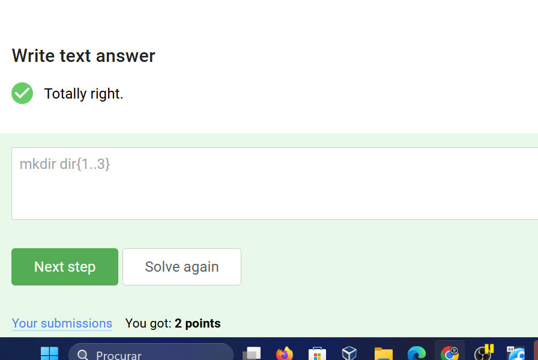
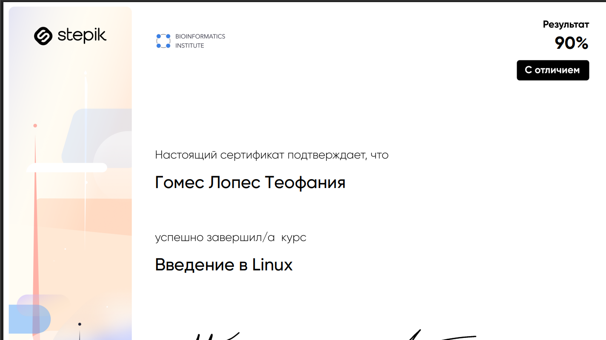

---
## Front matter
lang: ru-RU
title: 3 этапа внешних курсов
subtitle: Продвинутые темы
author:
  - Гомес Лопес Теофания

## Formatting pdf
toc: false
toc-title: Содержание
slide_level: 2
aspectratio: 169
section-titles: true
theme: metropolis
header-includes:
 - \metroset{progressbar=frametitle,sectionpage=progressbar,numbering=fraction}
---

# Цель работы

Ознакомиться с функционалом операционной системы Linux.

# Задание

Просмотреть видео и на основе полученной информации пройти тестовые задания.

# Выполнение лабораторной работы

3 Этап: 

{#fig:001 width=70%}

# Выполнение лабораторной работы

{#fig:004 width=70%}

Поиск и замена в редакторе работают по следующей схеме:

Для замены во всем файле можно использовать символ %.

{#fig:005 width=70%}

Команда $ — в конец текущей строки, W - до пробела вправо - то есть, перемещение.

Нажать Esc достаточно один раз, но да ладно.

Надпись visual - горит.

d — используется совместно с командами перемещения. Удаляет символы с текущего положения курсора до положения после ввода команды перемещения.

yy (также Y) — копирование текущей строки в буфер;

# Выполнение лабораторной работы

{#fig:006 width=70%}

Только из набора С потому что у каждой оболочки свой буфер, который при выходе из нее буде записываться в файл истории.

# Выполнение лабораторной работы

{#fig:007 width=70%}

`/home/bi/file1.txt` - потому что именно в этой директории мы создаем новый файл, а уже после его создания мы переходим в другую папку.

{#fig:008 width=70%}

Имя не может начинаться с цифры, содержать специальные символы или пробелы.

# Выполнение лабораторной работы

{#fig:009 width=70%}

1. Задаю общую часть в каждом выводе - слово "student": v=student
2. Выполняем команды для разных аргументов.
3. res - это результат для вывода
4. echo "$res" - вывести результат

{#fig:013 width=70%}

# Выполнение лабораторной работы

{#fig:015 width=70%}

{#fig:016 width=70%}

1. a = $a

2. a += b это то же самое, что и a = a + b, но с символами "+=" != "=+"

3. если выражение не в скобках, но с пробелами - работать не будет. (let a=a+b - сработает; let a = a + b - нет)

# Выполнение лабораторной работы

{#fig:017 width=70%}

`programm`  выполняет стандартный вывод в терминал (если это принцип работы программы). И нам нужно настроить вывод в файл.

# Выполнение лабораторной работы

{#fig:019 width=70%}

Первая переменная локальная, и это просто пустая строка, вторая переменная - это сумма арифметической прогрессии от 1 до 10, равна 55, но при умножении на 2 даст 110.

{#fig:020 width=70%}

# Выполнение лабораторной работы

{#fig:022 width=70%}

{#fig:023 width=70%}

Калькулятор выглядит обычно - мы вводим два числа, пишем, что с ними надо сделать, и потом, учитывая случаи ошибок, выводим результат.

# Выполнение лабораторной работы

{#fig:024 width=70%}

-iname ищет без учета регистра, а -name в точности как в запросе. Звездочка стоит после слова - это значит после слова может быть сколько угодно символов.

{#fig:025 width=70%}

Т.е. если идут 2...10...100 строк подряд, в которых обнаружилось совпадение, контекст будет выведен до и после этой ГРУППЫ строк, а не до и после каждой строки в этой группе

# Выполнение лабораторной работы

{#fig:028 width=70%}

The -n option disables the automatic printing, which means the lines you don't specifically tell it to print do not get printed, and lines you do explicitly tell it to print (e.g. with p) get printed only once. 

{#fig:031 width=70%}

аббревиатура ABBA отличается от двух других аббревиатур тем, что справа он неё стоит запятая без пробела: "ABBA,". 

# Выполнение лабораторной работы

{#fig:032 width=70%}

-persist lets plot windows survive after main gnuplot program exits. 

{#fig:033 width=70%}

- r - чтение;
- w - запись;
- x - выполнение;
- s - выполнение  от имени суперпользователя (дополнительный);

- u - владелец файла;
- g - группа файла;
- o - все остальные пользователи;

- 0 - никаких прав;
- 1 - только выполнение;
- 2 - только запись;
- 3 - выполнение и запись;
- 4 -  только чтение;
- 5 - чтение и выполнение;
- 6 - чтение и запись;
- 7 - чтение запись и выполнение.

# Выполнение лабораторной работы

{#fig:037 width=70%}

# Сертификат

{#fig:041 width=70%}

# Выводы

Я просмотрела курс и освежила в памяти навыки работы с более сложными командами в Линукс.
